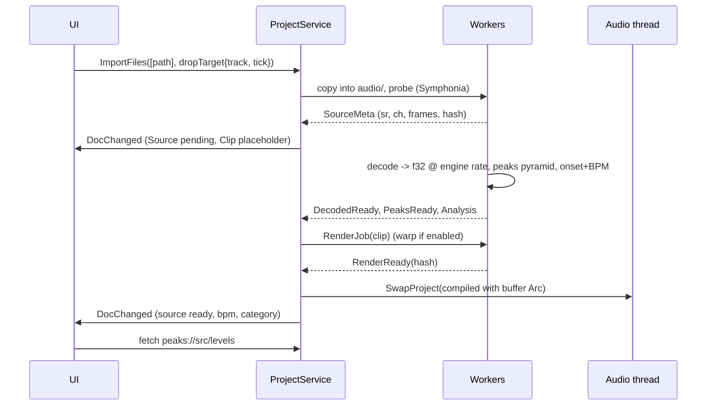

# Sampler DAW: Technical Design

| | |
|---|---|
| Status | Draft v1 (2026-10-07) |
| Inputs | `concepts/index.html`, `project/Main.dc.html` (Session view), `project/Arrangement.dc.html`, `project/Sampler.dc.html` (Sample editor), `project/canvas.json` |
| Audience | Solo hobbyist developer, Windows 10 |
| Working product name | "Sampler" (from the mock logo) |

---

## 1. Overview, goals, non-goals

**Product in one sentence:** a desktop DAW for Windows where you drop in an audio file (wav/mp3/flac/ogg/m4a), chop it into slices in a sample editor, play the slices from pads, and arrange slices and clips across several tracks into a new instrumental that you export to WAV or MP3.

**Architecture in one sentence:** a Tauri 2 desktop app. A **Rust core** owns the project document, undo history, file I/O, analysis and a **real-time audio engine** on a cpal callback (WASAPI on Windows, CoreAudio on macOS). A **React + TypeScript UI** renders in the OS webview (WebView2 on Windows, WKWebView on macOS) and draws the timeline and waveforms with Canvas 2D. The UI sends *intents* to the core. The core answers with document snapshots and a 60 Hz telemetry stream (playhead and meters).

**Key design principle: the engine plays prepared PCM only.** Decoding, resampling, time-stretch, pitch shift and reverse all run on worker threads and write into an immutable *render cache*. The real-time thread mixes cached buffers and applies only cheap per-sample work: gain, pan, fades, mute/solo and metering. This keeps the RT code small, deterministic and testable, and that is the most important simplification for a solo developer. Section 14 lists the cost (re-render latency when tempo or warp settings change) and its mitigation.

### Goals (MVP)
1. Import common audio formats by drag & drop or the browser. Files are copied into the project.
2. Sample editor: auto-slice (Beat grid, Transient, Manual), per-slice pitch/gain/reverse/play mode, 4x4 pads played by mouse or keyboard.
3. Multi-track arrangement: place, move, trim, split, duplicate and delete clips, snap to grid, loop region, playhead.
4. Warp: fit a clip's source BPM to the project tempo (Re-pitch, Beats, Tones and Texture modes).
5. Mixer basics: volume fader, pan, mute, solo, peak meters per track plus master. Metronome.
6. Unlimited undo/redo, save/load, autosave and crash recovery.
7. Export: master to WAV (16/24/32f) and MP3, plus per-track stems.
8. Glitch-free playback on a stock Windows 10/11 machine and on a macOS machine (Apple Silicon and Intel, macOS 12+). Default latency is about 10 to 20 ms with WASAPI shared mode, or about 3 to 6 ms with ASIO as an option on Windows. CoreAudio on macOS typically gives about 5 to 10 ms at a 256-frame buffer with no extra driver.
9. **Supported platforms: Windows 10/11 x64 and macOS (arm64 + x64). Nothing else.** All platform-specific code lives behind the `AudioHost` trait and a small `platform` module (paths, menus, shortcuts, packaging).

### Post-MVP (v1.x and later, the "path")
Session view clip launching (see Q1 for why it is not in the MVP core), audio recording, tempo automation and real-time warp, effects (EQ/compressor/reverb/delay), automation lanes, MIDI and a pad-sequence clip, VST3/CLAP hosting, stem separation.

### Non-goals
Video, notation, surround, collaboration and cloud, mobile, a browser/web build, a plugin *format* (we host plugins, we never ship one), and Linux (not blocked, but not tested or packaged).

---

## 2. Requirements derived from the UX mocks

IDs are used throughout the document. Phase: **MVP**, **v1** (first release after MVP), **Later**.

### 2.1 Global header (Session + Arrangement)

| ID | Mock element | Requirement | Design component | Phase |
|---|---|---|---|---|
| G1 | "Sampler" logo | App identity | `AppShell` | MVP |
| G2 | Session / Arrange segmented toggle | Switch main view, keep transport running, keep the selection per view | `ViewRouter` (UI state `view`) | MVP (Arrange), v1 (Session) |
| G3 | Stop button | Stop transport. A second press returns to the start (or loop start) | `TransportController` -> `EngineMsg::Stop` | MVP |
| G4 | Play button (highlighted while playing) | Toggle play from the current position. Shows state from engine telemetry, not optimistic UI | `TransportController`, `Telemetry.transport.playing` | MVP |
| G5 | Record button (red) | Arm recording of armed tracks from input | `RecordService` (Later). Disabled in MVP with a tooltip | Later |
| G6 | TEMPO 120.00 | Project tempo 20 to 999 BPM, two decimals, edited by drag or typing. A change triggers a warp re-render | `Project.tempo`, `RenderCacheScheduler` | MVP |
| G7 | TIME SIG 4 / 4 | Numerator 1 to 32, denominator 2/4/8/16. Drives the ruler, snap and metronome accent | `Project.timeSig`, `BeatTime` | MVP |
| G8 | POSITION "5 . 2 . 3" | Show bars.beats.sixteenths (1-based) from engine sample position at 60 Hz. Click to type a position for locate | `PositionDisplay`, `BeatTime::fromSamples` | MVP |
| G9 | "Click" button | Metronome on/off. Accent on beat 1. Output on the master bus (excluded from export unless chosen) | `Metronome` engine node | MVP |
| G10 | "Loop" button (Arrange) | Toggle the arrangement loop. Playback wraps sample-accurately at the loop end | `Transport.loop`, block-splitting in the engine | MVP |
| G11 | "Snap: 1 bar" (Arrange) | Grid snap value: off, 1 bar, 1/2, 1/4, 1/8, 1/16, 1/32 and triplets. Hold Alt to bypass. Toolbar shows the current value | `SnapService` (UI) | MVP |
| G12 | "44.1 kHz · 5.8 ms" | Show the actual device sample rate and output latency (buffer/sr; 256 / 44100 = 5.8 ms). Click opens Audio Settings (device, driver, buffer size, rate) | `AudioHost.status`, `AudioSettingsDialog` | MVP |

### 2.2 Session view (`Main.dc.html`)

| ID | Mock element | Requirement | Design component | Phase |
|---|---|---|---|---|
| S1 | Sample browser search box | Search imported samples by name and tag, incremental, in memory | `LibraryIndex` (core), `BrowserPanel` | MVP |
| S2 | PLACES: All samples / Loops / One-shots / Recordings | Filter by category. Category comes from auto-classification (length plus onsets: loop if 1 to 64 bars at the detected BPM, otherwise one-shot if under 2 s), user-editable. "Recordings" fills once recording exists | `SampleMeta.category`, `Classifier` | MVP (Recordings: Later) |
| S3 | File rows with mini-waveform icon, name, tag (loop/phrase/one-shot/texture) | List samples with a real thumbnail (from the peak cache), name and tag. Click previews through the audition bus. Drag onto a track or slot to create a clip | `BrowserPanel`, `PeakCache` level 4, `Audition` | MVP |
| S4 | "Drop audio here to start sampling" | OS file drop anywhere imports. Dropping on the drop zone also opens the Sample editor for that file | `ImportService`, Tauri drag-drop event | MVP |
| S5 | Track column header (colour, name) | Track has a name and a colour from a 12-colour palette. Double-click to rename | `Track.name/color` | v1 |
| S6 | Clip slots (filled: play icon + name; active: full colour; empty: dark) | 2-D grid track x scene. A slot holds 0 or 1 clip. Click launches (quantised to 1 bar by default) or stops. Show states: stopped, queued (blinking), playing. One playing clip per track | `SessionGrid`, `EngineMsg::LaunchSlot`, `LaunchQuantize` | v1 |
| S7 | Scene launch buttons 1..5 | Launch every clip in a row. Empty slots in the row stop that track (Ableton semantics; the mock's code does this too) | `EngineMsg::LaunchScene` | v1 |
| S8 | Master column with "Stop all" | Stop all session clips (quantised) | `EngineMsg::StopAllSlots` | v1 |
| S9 | Track mixer strip: M, S, R, fader, meter, "-4.5 dB" | Volume fader (-inf..+6 dB, 0 dB detent), peak meter (post-fader, with peak hold), dB readout, Mute, Solo (exclusive with Ctrl), Arm (Later) | `MixerStrip`, `TrackParams`, `Meters` | MVP (fader/M/S also in Arrange) |
| S10 | Master strip fader + meter | Master volume and meter, plus a clip indicator above 0 dBFS | `MasterBus` | MVP |
| S11 | "+ Audio track" | Add an audio track (also in Arrange) | `Cmd::AddTrack` | MVP |
| S12 | Bottom detail panel: colour, clip name, "Drums · 4 bars", "Open in sample editor" | Inspector for the selected clip. Opens the Sample editor on the clip's source/slice set | `ClipInspector`, `ViewRouter` | MVP |
| S13 | WARP On toggle | Warp on: clip follows the project tempo. Off: plays at native speed | `Clip.warp.enabled` | MVP |
| S14 | MODE: Beats / Tones / Texture / Re-pitch | Warp algorithm per clip (mapping in section 7.6) | `WarpRenderer` | MVP (Re-pitch, Beats, Tones), v1 (Texture tuning) |
| S15 | BPM 90.00 | Clip *source* BPM, auto-detected and editable. Half/double buttons | `Clip.warp.sourceBpm`, `BpmDetector` | MVP |
| S16 | GAIN 0.0 dB | Clip gain -inf..+24 dB, applied in real time | `Clip.gainDb` | MVP |
| S17 | LENGTH 4 bars | Clip length in musical time (editable) | `Clip.length` | MVP |
| S18 | LOOP On | Clip loops its region within its length on the timeline or in the slot | `Clip.loop` | MVP |
| S19 | Clip waveform with bar ruler 1..4, grid and playhead | Detail waveform of the clip region with a beat grid and a live playhead when playing. Drag the edges to set region start/end. Click to audition from that point | `WaveformView` (shared component) | MVP |

### 2.3 Arrangement view (`Arrangement.dc.html`)

| ID | Mock element | Requirement | Design component | Phase |
|---|---|---|---|---|
| A1 | Bar ruler 1..16 | Musical ruler that adapts to zoom (bars, beats, ticks). Click to locate, drag for a time selection | `TimelineRuler` (canvas) | MVP |
| A2 | Orange loop region over the ruler (bars 5 to 8) | Loop range with draggable edges and a draggable body, snapped. Brighter when loop is enabled | `Transport.loopRange`, `LoopBrace` | MVP |
| A3 | Track header: colour, name, M/S/R, dB | Same model as S5/S9. Compact strip with a volume readout that you can drag to change | `TrackHeader` | MVP |
| A4 | Track lanes with grid lines | Horizontal lanes, 112 px tall by default (resizable). Grid density follows zoom and snap | `TimelineCanvas` | MVP |
| A5 | Clips: track colour, name, waveform thumbnail, ring when selected | Clip rectangles with a waveform drawn from the peak cache. Select (click, Shift/Ctrl add, marquee), move (also across tracks), trim the left/right edge (non-destructive), split (Ctrl+E), duplicate (Ctrl+D), delete, copy/paste. No overlaps: a later clip truncates the earlier one (section 8.3) | `ArrangementEditor`, commands in 8.4 | MVP |
| A6 | Same source reused ("Break 90" x4, "Keys Chop 1" x2) | Many clips reference one source with no copying of audio | Non-destructive clip model (7.1) | MVP |
| A7 | "Reverse Keys" clip | Per-clip reverse | `Clip.reverse` | MVP |
| A8 | "+ Audio track" plus the hint "Drag a sample from the browser onto the timeline to create a clip" | Drop from the browser (or the OS) onto a lane creates a clip at the snapped position. Dropping below the last lane creates a new track | `DropController` | MVP |
| A9 | Playhead line over all lanes | Playhead at 60 fps, interpolated between telemetry ticks. Follow mode (page scroll) is optional | `PlayheadOverlay` | MVP |
| A10 | Bottom inspector: name, track, "Bars 1-4", GAIN, START, FADE IN, FADE OUT, waveform | Clip gain, timeline start (editable), fade in/out in ms (0 to clip length), plus a waveform with fade curves drawn | `ClipInspector` | MVP |
| A11 | 16-bar view | Horizontal zoom (Ctrl+wheel, pinch, Z to zoom to selection) and scroll. Project length grows automatically | `Viewport` | MVP |

### 2.4 Sample editor (`Sampler.dc.html`)

| ID | Mock element | Requirement | Design component | Phase |
|---|---|---|---|---|
| E1 | "< Session" back button | Return to the view you came from (mock shows Session only, see Q9) | `ViewRouter.back()` | MVP |
| E2 | Title "Break 90", meta "4 bars · 90 BPM · 44.1 kHz · stereo" | Show source name, length in bars at the detected BPM, BPM, native sample rate and channels | `SampleMeta` | MVP |
| E3 | Audition button | Play the whole region (or the selected slice) through the audition bus, independent of the transport | `Audition` | MVP |
| E4 | Slice mode: Beat / Transient / Manual | Choose the slicing algorithm. Switching modes regenerates markers. Manual keeps the existing markers and lets you edit them | `Slicer` (7.2) | MVP |
| E5 | Divisions 1/4, 1/8, 1/16, 1/32 | Grid division for Beat mode, relative to the source BPM and the downbeat offset | `Slicer::beatGrid` | MVP |
| E6 | Sensitivity slider 0 to 100 | Onset threshold for Transient mode | `OnsetDetector` | MVP |
| E7 | "Auto-slice" button | Run the chosen algorithm and replace the markers (undoable) | `Cmd::AutoSlice` | MVP |
| E8 | "16 slices" counter | Live slice count | derived | MVP |
| E9 | Slice strip 1..16 (selected one highlighted) | Clickable slice index strip above the waveform. Scrolls/zooms with the waveform when there are more than about 32 slices | `SliceStrip` | MVP |
| E10 | Waveform with markers and a highlighted selected slice | Zoomable waveform. Markers can be dragged (snap to zero crossing optional), double-click adds or removes a marker. Selected slice is shaded | `WaveformView` + `MarkerLayer` | MVP |
| E11 | 4x4 pads, keys 1234 / QWER / ASDF / ZXCV, pad 1 bottom-left (MPC layout) | Pad n triggers slice n. Mouse down/up and key down/up are delivered as note-on/off. Pad flashes on trigger. More than 16 slices: pad banks A/B/C/... (not in mock, Q8) | `PadGrid`, `EngineMsg::PadOn/Off`, `KeyboardRouter` (pad scope) | MVP |
| E12 | "Click a pad or press its key to play a slice" | Pads also *select* the slice (mock behaviour) | UI state | MVP |
| E13 | Slice START / END ("1.3.1", "1.4.1") | Shown in source-relative bars.beats.sixteenths at the source BPM. Editable. Toggle to show samples/seconds | `Slice.start/end` (frames) + `BeatTime` | MVP |
| E14 | LENGTH "1 beat" | Derived length in musical units | derived | MVP |
| E15 | PITCH "0 st" | Transpose -24..+24 semitones (plus cents in v1) | `Slice.pitch` -> render cache | MVP |
| E16 | GAIN "0.0 dB" | Per-slice gain | `Slice.gainDb` | MVP |
| E17 | REVERSE toggle | Per-slice reverse | `Slice.reverse` | MVP |
| E18 | PLAY MODE One-shot / Gate / Loop | One-shot plays to the end. Gate stops on release (with a release fade). Loop loops the slice while held | `PadVoice` | MVP |
| E19 | "Send slices to Session" | Turn slices into clips. Default (Q7): creates a new track named after the sample, with one clip per slice. In Session it fills consecutive slots (adds scenes if needed). In Arrange a sibling action, "Slices to new track", places them back-to-back from the playhead | `Cmd::SlicesToTrack` | MVP (Arrange variant), v1 (Session) |

### 2.5 Implied by the mocks (not drawn but required)
Audio settings dialog (G12), project open/save/new, a menu bar or command palette, a playing state for audition and pads, an error toast on import failure, a progress indicator for long imports and renders, and an export dialog. These are covered in sections 10 and 11.

---

## 3. Technology decisions

| # | Area | Decision | Rationale (short) | Rejected alternatives |
|---|---|---|---|---|
| T1 | App shell | **Tauri 2** (2.11.x as of mid-2026), WebView2 on Windows and WKWebView on macOS | Native Rust backend in the same process as the audio engine. Web UI that matches the HTML mocks. Small installer (about 10 MB vs 100+ MB). Binary IPC channels | **Electron**: 150 MB+, and the audio engine would have to be a Node native addon or a sidecar, which is awkward. **JUCE C++**: excellent audio and plugin hosting, but building UI in JUCE is slow work for a solo developer, C++ memory-safety costs are high, and JUCE 8 is AGPLv3 or a JUCE licence (free Starter tier only up to $20k revenue). **Qt/QML**: heavy, and its licensing is LGPL/commercial with similar friction |
| T2 | Languages | **Rust** (core, engine, DSP, I/O) + **TypeScript** (UI). Small amount of C++ only inside vendored DSP (Signalsmith) | Rust gives memory safety and fearless threading for the RT/worker split, plus a strong audio crate ecosystem. TS is the natural UI language | C++ everywhere (productivity and safety); C# / .NET + NAudio (GC pauses on the audio path need care, weaker DSP ecosystem, and no web-mock reuse) |
| T3 | UI framework | **React 19 + Vite + Zustand** (state) + plain CSS modules using the mock's design tokens | Most documentation and examples, easy to hire LLM help with, and Zustand is minimal. Performance-critical surfaces bypass React (T8) | Svelte/Solid: smaller and faster, but less ecosystem. The hot paths are canvas anyway, so framework speed does not matter |
| T4 | Audio engine | **Custom Rust engine**: fixed topology mixer (tracks -> master), with a `Processor` trait seam for later effects | The MVP graph is trivial. A custom engine is about 3k LOC and fully understood | **Web Audio API** in WebView2 (no sample-accurate control of a complex timeline, GC in the audio path, hard offline determinism); **fundsp/knyst graph crates** (more abstraction than needed); **JUCE AudioProcessorGraph** (rejected with JUCE) |
| T5 | Audio I/O | **cpal 0.18.x**: **WASAPI** by default and the **ASIO** cargo feature as opt-in on Windows; **CoreAudio** on macOS (no extra driver or SDK) | cpal is the standard Rust I/O crate. WASAPI works on every Windows machine. ASIO gives about 3 to 6 ms on proper interfaces, and the Steinberg ASIO SDK has been dual-licensed GPLv3 / proprietary since Oct 2025. The ASIO build needs LLVM/Clang | **PortAudio** via FFI (C dependency, no advantage); **raw WASAPI exclusive** via the `wasapi` crate (lower latency without ASIO, but locks the device for other apps. Kept as a possible v1 backend behind the same `AudioHost` trait) |
| T6 | Decoding | **Symphonia 0.5.x** (MPL-2.0): WAV, AIFF, FLAC, MP3, OGG Vorbis, Opus, AAC-LC/M4A, ALAC, WavPack | Pure Rust, no DLLs, performance within about ±15% of FFmpeg. MPL-2.0 is file-level copyleft, so using it unmodified creates no obligation for our code | **FFmpeg** (huge, LGPL dynamic linking needed and GPL if built with some codecs, plus a DLL zoo on Windows. Kept only as an *optional* user-supplied `ffmpeg.exe` fallback for exotic formats, run as a subprocess so there is no linking); **Media Foundation** (Windows-only API, verbose) |
| T7 | Resampling | **rubato** (MIT; pin the current release at M0) using the sinc async resampler for import and the fast polynomial resampler for varispeed/re-pitch | Quality is good and the licence is permissive. Also used for device-rate changes | libsamplerate (BSD, C FFI, no gain); speexdsp (BSD, lower quality) |
| T8 | Time-stretch / pitch | **Signalsmith Stretch 1.x** (MIT, header-only C++11) via a thin `cc`/`cxx` wrapper (or an existing crate such as `signalsmith-stretch`) for Tones/Texture. **Own transient-segment algorithm** for Beats. **rubato varispeed** for Re-pitch | MIT allows any licence including closed source. Good quality for polyphonic material | **Rubber Band 4** (best-in-class quality but GPL-2.0-or-later; closed or commercial distribution needs a paid licence from Breakfast Quay. Kept as an optional swap-in behind the `Stretcher` trait if the app ends up GPL); **SoundTouch 2.4** (LGPL-2.1, WSOLA, audible artefacts on polyphonic material, and LGPL relink obligations) |
| T9 | Waveform rendering | Rust-computed **multi-resolution min/max peak pyramid**, transferred as binary, drawn on **Canvas 2D** with per-clip bitmap tile caching. Playhead on a separate overlay canvas | Canvas 2D in Chromium is GPU-accelerated and can draw hundreds of clips at 60 fps. Simple to debug | **SVG** like the mocks (DOM explodes with thousands of path segments); **WebGL/PixiJS** (more power than needed for MVP. This is the upgrade path if profiling shows it is needed) |
| T10 | Analysis | **realfft** (MIT/Apache) spectral-flux onset detection plus **own BPM estimator** (onset autocorrelation + loop-length heuristic) | Small, well understood algorithms, about 500 LOC | **aubio** (GPL-3 and C); **essentia** (AGPL); ML beat trackers (heavy, Later) |
| T11 | Encoding | **hound** (Apache-2.0/MIT) for WAV. **LAME 3.100** via `mp3lame-encoder`/`mp3lame-sys` for MP3 (LGPL. Static linking makes the binary carry LGPL obligations; see Q2). **flacenc** (pure Rust) for FLAC in v1 | WAV is trivial. LAME is still the reference MP3 encoder | `shine` (LGPL too, worse quality); FFmpeg subprocess (it would be a hard dependency) |
| T12 | Lock-free messaging | **rtrb** (SPSC ring buffer) for commands and returns. **Atomics** (`AtomicU32` holding f32 bits, `AtomicU64`) for params, meters and position. **basedrop**-style deferred deallocation (or a hand-written "garbage return queue") | Proven and minimal. No allocation and no locks on the audio thread | crossbeam channels (the bounded MPMC variant can take locks under contention); `Mutex` with `try_lock` (priority inversion risk) |
| T13 | Project format | **Folder bundle** `Name.sdaw/` containing `project.json` (serde, versioned), `audio/` (copied originals), `cache/` (disposable) and `autosave/` | Human-readable, diffable and easy to migrate. Audio stays next to the project, so the project can be moved | Single zip (slow saves, no partial writes); SQLite (opaque, overkill); binary formats (no diffing) |
| T14 | Persistence for app prefs/library | `%APPDATA%\Sampler\settings.json` + `library.json` (sample index). The library index is rebuilt from disk if it is lost | Simple and file-based | SQLite (later, if the library grows past about 10k samples) |
| T15 | Undo/redo | **Snapshot undo** over an immutable document using persistent collections (`im` crate). Edits are expressed as **commands** (the API), but undo stores `(label, Arc<Project>)` | Inverse-operation undo is a common source of bugs. With structural sharing a snapshot costs KBs. Coalescing (for example a fader drag) is trivial | Inverse command undo (bug-prone); full JSON snapshots (OK but wasteful) |
| T16 | Build & packaging | **Cargo workspace** + **pnpm** + **Vite**. `tauri build` produces an **NSIS** installer on Windows (WebView2 bootstrapper included) and a signed, notarized **.app/.dmg** on macOS (universal or per-arch). GitHub Actions matrix CI on `windows-latest` and `macos-latest` (macOS builds and tests run on CI, not on the dev PC) | Standard Tauri path, one command to build | MSI/WiX only (NSIS is friendlier); MSIX (signing friction) |
| T17 | Testing | Rust: `cargo test` + **golden-render tests** via the headless `sdaw-cli`, `proptest` for model and undo, `assert_no_alloc` on the RT callback in debug builds. TS: **Vitest** (logic), **Playwright** against the UI running in a browser with a mocked core, plus a small **tauri-driver** (WebDriver) smoke suite | Determinism comes from offline render. Most tests run without audio hardware | Manual listening only (not repeatable) |
| T18 | Licence of the app itself | Default **GPL-3.0-or-later** if the user does not decide (Q2). Every dependency above is compatible with it. If the user wants closed source, the stack still works: Rubber Band stays out, and LAME needs dynamic linking or relink objects | Avoids accidental violations and keeps Rubber Band/ASIO-GPL options open | n/a |

---

## 4. System architecture

### 4.1 Process and thread view

```
 ┌───────────────────────── OS webview process(es) (WebView2 / WKWebView) ─────────────────────────┐
 │  UI main thread (React)                                                 │
 │   ├─ DOM panels: browser, headers, inspector, pads, dialogs             │
 │   ├─ Canvas layers: TimelineCanvas, WaveformView, PlayheadOverlay (rAF) │
 │   └─ Zustand stores: doc mirror (read-only), ui state, telemetry        │
 │  Web Worker: waveform tile rasteriser (OffscreenCanvas)                 │
 └───────────▲───────────────────────────────┬─────────────────────────────┘
   doc snapshots / patches,                    │ invoke(intent)  (JSON)
   telemetry @60Hz (binary Channel),           │ fetch peaks (binary, custom
   job progress events                         ▼ protocol peaks://)
 ┌──────────────────────── Rust core process (Tauri) ──────────────────────┐
 │  Control thread(s) (tokio runtime)                                       │
 │   ProjectService ─ owns Arc<Project>, UndoStack, applies Commands        │
 │        │ on change: diff -> EngineCompiler -> Box<EngineProject>         │
 │        │                       -> RenderCacheScheduler (jobs)           │
 │        ▼                                                                 │
 │   EngineHandle ── rtrb SPSC (EngineMsg) ───────────────┐                 │
 │        ▲          rtrb SPSC (Garbage) ◄────────┐       │                 │
 │        │                                        │       ▼                 │
 │   Telemetry thread (60Hz) ◄── atomics ──  AUDIO THREAD (cpal callback,   │
 │        │   reads pos/meters/states             MMCSS "Pro Audio")        │
 │        └─► UI Channel                         Engine::process(block)     │
 │                                                                          │
 │  Worker pool (rayon, N-1 cores): decode, resample, peaks, onset/BPM,     │
 │     warp/pitch/reverse render -> RenderCache (Arc<[f32]> buffers)        │
 │  GC thread: drops retired EngineProjects & buffers                       │
 │  Export thread: OfflineEngine (same Engine code, no device)              │
 └──────────────────────────────────────────────────────────────────────────┘
```

**Process boundaries:** one Rust process plus the OS webview's helper processes (Chromium-based WebView2 on Windows, WebKit on macOS). No separate engine process in MVP. The engine is isolated by thread and by API rather than by process. A sandboxed plugin-host process arrives with VST3 (section 15).

### 4.2 Ownership and message rules
1. **The Rust core is the single source of truth** for the document. The UI holds a read-only mirror plus *ephemeral* UI state (selection, zoom, scroll, drag previews).
2. **UI -> core:** `invoke("cmd", {type, ...})` with intent commands (`MoveClips`, `SetTrackVolume`, ...). Continuous gestures (a fader or clip drag) send `begin`/`update`/`commit` and are coalesced into a single undo entry. During a clip drag the UI renders an optimistic preview and sends only the commit.
3. **Core -> UI:** after every applied command, a `DocChanged { rev, patch }` event (JSON Patch of the serialised doc; a full snapshot on load or when out of sync). The UI checks `rev` continuity and requests a full snapshot on a gap.
4. **Core -> engine:** compiled `EngineProject` (immutable, Boxed) via `EngineMsg::SwapProject`. Fast parameters (volume, pan, mute, solo, master) bypass compilation as `EngineMsg::SetParam` *and* also update the document.
5. **Engine -> outside:** only atomics (position, meters, slot states, CPU load) and the garbage queue. The engine never calls back.
6. **Binary bulk data** (peaks, raw sample windows for deep zoom) goes through a Tauri custom URI protocol (`peaks://<sourceId>/<level>`) returning an `ArrayBuffer`, never JSON.

### 4.3 Sequence: drop file -> clip on timeline


---

## 5. Audio engine design

### 5.1 Real-time safety rules (enforced, not aspirational)
Inside `Engine::process` and everything it calls:
- No heap allocation or free. Debug builds wrap the callback in `assert_no_alloc`, so any allocation panics in tests.
- No locks, no syscalls, no I/O, no logging (a lock-free log ring is allowed), no `println!`.
- No unbounded loops. Work is O(active voices x block size).
- Drop nothing that owns heap memory. Retired objects go back through the garbage ring.
- Every buffer is preallocated at `prepare(max_block, sr, channels)`. Scratch buffers are sized for `max_block = 4096`.
- The audio thread joins MMCSS "Pro Audio" (`AvSetMmThreadCharacteristicsW`) on the first callback, if cpal has not already done so (verify at M0). FTZ/DAZ are set to avoid denormal stalls.
- The callback measures its own time and publishes `cpu_load = elapsed / block_duration` (EMA) plus an xrun counter.

### 5.2 Graph and mixer (MVP topology)
```
 per Track:  [ClipPlayer: active clip voices] ─► Σ ─► clip-gain/fades (per voice, before Σ)
             ─► TrackGain (smoothed) ─► Pan (-3 dB equal-power) ─► Mute/Solo gate (5 ms ramp)
             ─► PeakMeter ─► (insert chain: empty Vec<Box<dyn Processor>> — v1 effects seam)
                                                       │
 Σ all tracks ──────────────────────────────────────────┴─► MasterGain ─► MasterMeter ─► out
 AuditionBus (browser preview, sample-editor audition, pads) ─► MasterGain (pre-meter)
 Metronome ─► out (post-master, excluded from export unless "include click")
```
- Internal format: **f32, non-interleaved stereo** throughout. Mono sources are duplicated at render time. Output is converted to the device format in the host adapter.
- Solo logic: if any track is soloed, non-soloed tracks are gated. The audition bus is never muted by solo.
- Parameter smoothing: linear ramp across 1 block (minimum 64 samples) for gain and pan to avoid zipper noise.
- No clipping protection on master (true DAW behaviour). The meter shows overs. Export has optional normalisation.
- **Effects seam:** `trait Processor { fn prepare(&mut self, sr, max_block); fn process(&mut self, io: &mut AudioBuf, ctx: &ProcessCtx); fn latency(&self) -> u32 }`. Processors are created off-thread and swapped in with `SwapProject`. Plugin delay compensation is computed by the `EngineCompiler` when processors report latency (v1+).

### 5.3 Time model
| Domain | Unit | Type | Where used |
|---|---|---|---|
| Musical (document) | **ticks, PPQ = 960** | `i64` | Clip start/length on the timeline, loop range, snap, slice musical display |
| Engine timeline | **samples at engine rate** | `i64` | Scheduling, transport position |
| Source | **frames at the source's native rate** | `i64` | Clip region, slice markers (independent of device rate) |
| Wall-clock UI | ms | `f64` | Playhead interpolation only |

- MVP has a **single tempo and time signature per project** (G6/G7). `samples = ticks * 60 * sr / (bpm * 960)`. This is computed in `f64` and rounded once at compile time per clip edge, so there is no accumulated drift. The `EngineCompiler` precomputes every clip's `[start_sample, end_sample)` and a sorted interval index per track.
- **Tempo map (Later):** replace the constant with a piecewise `TempoMap` (segments with constant BPM, later ramps). `BeatTime` already routes every conversion through one trait (`TimeConverter`), so only that implementation changes.
- Position display (G8): `ticks -> bar.beat.sixteenth` using the time signature. Bars and beats are 1-based.

### 5.4 Transport and sample-accurate scheduling
Transport state (engine-owned): `playing`, `pos_samples`, `loop_enabled`, `loop_start/end_samples`. Per callback of `n` frames:

```rust
// illustrative
fn process(&mut self, out: &mut [&mut [f32]], n: usize) {
    self.drain_messages();                 // apply EngineMsg (swap, params, transport, launches)
    let mut done = 0;
    while done < n {
        let mut len = n - done;
        if self.t.playing && self.t.loop_enabled {
            let to_end = (self.t.loop_end - self.t.pos) as usize;
            if to_end == 0 { self.seek_internal(self.t.loop_start); continue; } // re-evaluate voices
            len = len.min(to_end);         // split block at loop end
        }
        self.render_segment(out, done, len); // tracks: find clips overlapping [pos, pos+len)
        if self.t.playing { self.t.pos += len as i64; }
        done += len;
    }
    self.publish_telemetry();
}
```
- **Clip rendering:** for each clip overlapping the segment, `offset_in_block = max(0, clip.start - pos)` and `src_index = (pos + i - clip.start) + clip.render_offset`. The source is the clip's **rendered buffer**, already warped/pitched/reversed at engine rate (section 7), so reads are 1:1 sample copies. Looping clips wrap the index modulo the rendered loop length.
- **Edge declicking:** every clip start, end, loop-wrap and seek applies a short fade (default **3 ms**, set per project). User fades (A10) are applied on top (linear-in-dB curve by default; equal-power option in v1).
- **Seek during playback:** active voices get a 3 ms fade-out tail (preallocated tail voices) while new voices fade in. This prevents clicks.
- **Session launch (v1):** `LaunchSlot{track, slot, quantize}` resolves in the engine to `launch_at = next multiple of quantize ≥ pos` (bars converted to samples). Until then the slot state is `Queued`, which the UI blinks. On switching clips within a track, the old clip fades out over 3 ms at `launch_at`. A track playing a session clip overrides its arrangement clips until "Back to arrangement" (Ableton semantics; see Q1).
- **Pads/audition:** `PadOn{slice_buffer_id, mode, velocity}` starts a voice from a pool of 16 (oldest is stolen with a 3 ms fade), rendered at the *next block start*. That gives at most one block of jitter, which is acceptable for live triggering and avoids timestamp sync problems with the UI. Retriggering the same pad chokes its previous voice.

### 5.5 Sample-rate handling
- **Engine rate = device rate.** The default is the device's mix format (usually 48 kHz, 44.1 kHz on many interfaces), and the user can choose it in settings.
- Sources keep their native rate on disk. On load they are decoded and **resampled once to the engine rate** (rubato sinc, high quality) into an in-memory `DecodedSource`, which is also cached to disk as `cache/<hash>@<sr>.f32` for fast reopen.
- When the device rate changes, the transport stops, every decoded source and render is re-made at the new rate (progress shown), and the engine is recompiled. Document positions in ticks and source frames are rate-independent, so nothing in the document changes.
- Export can render at a different rate. MVP renders at the engine rate and resamples the master output with rubato when the export rate differs.

### 5.6 Buffers and memory
- MVP keeps **all decoded sources and renders in RAM** as f32 stereo. Budget: 1 minute at 48 kHz stereo = 23 MB. A typical project (5 sources of about 3 minutes plus renders) is about 0.6 to 1 GB. **Warn above 2 GB.** Disk streaming is Later (Risk R5).
- `RenderBuffer = Arc<[f32]>` (planar, `ch * len`). The engine holds Arcs inside `EngineProject`. A retired project goes back over the garbage ring, so the final `Arc` drop never happens on the audio thread.

### 5.7 Lock-free command and parameter queues
```rust
enum EngineMsg {                                  // all variants are POD or Box/Arc, built off-thread
    SwapProject(Box<EngineProject>),
    Play, Stop, Seek(i64), SetLoop{ on: bool, start: i64, end: i64 },
    SetParam{ target: ParamTarget, value: f32 },  // track vol/pan/mute/solo, master, click
    LaunchSlot{ track: u16, slot: u16, q: Quantize }, LaunchScene(u16), StopAllSlots,
    PadOn{ voice_key: u32, buf: Arc<RenderBuffer>, mode: PlayMode, gain: f32 },
    PadOff{ voice_key: u32 },
    Audition{ buf: Arc<RenderBuffer>, start: usize }, AuditionStop,
}
```
- Command ring: `rtrb` with 1024 capacity. If it is full, the control side retries on the next tick and **coalesces** param messages (only the latest value per target matters).
- Garbage ring: 256 capacity. The GC thread drains it every 50 ms.
- Telemetry: a struct of atomics written once per callback: `pos_samples: AtomicI64`, `playing: AtomicBool`, `track_peak[i]: AtomicU32 (f32 bits)` with **max-hold since last read** (`fetch_max` on bits works because peaks are non-negative), `slot_state[i]`, `cpu_load`, `xruns`.

### 5.8 Metering
- Per track and master: **sample peak** (max abs per block, decayed in the UI at 20 dB/s with a 1.5 s peak hold) + **RMS** (300 ms window) shown as a darker inner bar. Meters are post-fader.
- Telemetry thread at 60 Hz -> Tauri `Channel<Vec<u8>>` (compact binary: rev, pos, playing, N x (peak, rms)). The UI uses `performance.now()` to interpolate the playhead between packets.
- Overload indicator latches at > 0 dBFS until clicked.
- True-peak and LUFS for export: v1 (optional in the export dialog).

### 5.9 Latency
- Reported latency = output buffer latency (`frames / sr`) as in mock G12. Where the backend can report it, the device's stream latency is added, for example WASAPI `GetStreamLatency`.
- Defaults: **WASAPI shared mode, buffer request 480 frames @ 48 kHz (10 ms)**. The shared-mode engine period is typically 10 ms, so the mock's "5.8 ms" is **not achievable** with shared WASAPI on most hardware. It needs ASIO or exclusive mode (Q4).
- **ASIO** build feature: user-selectable buffer of 64 to 1024 frames.
- Latency matters for pads (E11) and for monitoring when recording (Later). Arrangement playback is not latency-sensitive because the UI playhead is compensated by the reported output latency.

### 5.10 Offline render and export path
- `OfflineEngine` = the **same `Engine` struct** driven by a loop instead of a device: `prepare(sr, block=1024)`, `SwapProject`, `Seek(start)`, `Play`, then `process()` until `end + tail`. It runs on the export thread as fast as possible (expect about 50 to 200x real time for MVP projects).
- Because the engine plays only prepared buffers, offline output is **bit-identical** to real-time output for the same project and block size. Differences across block sizes are limited to ramp positions, and tests pin the block size.
- Before rendering, export waits until the `RenderCacheScheduler` has no pending jobs.

---

## 6. Audio file pipeline

### 6.1 Import
1. **Accept:** OS drop (Tauri drag-drop event gives paths), browser drag, or the File > Import dialog. Accepted extensions: `wav, aif, aiff, flac, mp3, ogg, oga, opus, m4a, mp4 (audio), aac, alac, wv`. Anything else is offered to `ffmpeg.exe` if the user configured it.
2. **Probe** with Symphonia (format, codec, sr, channels, frames; for MP3 the frame count comes from a full scan because Xing headers are unreliable). Reject files longer than 30 minutes in MVP with a clear error.
3. **Copy into project:** `audio/<sanitised-name>-<hash8>.<ext>`, where the hash is BLAKE3 of the file bytes. Duplicates are deduplicated by hash. The original path is stored for reference only. "Collect all and save" is the default and only mode in MVP (Q12).
4. **Decode** to f32 planar (MP3 encoder delay and padding trimmed using LAME/Xing gapless info, which Symphonia exposes; verify at M1 with a test file) -> **resample** to engine rate -> `DecodedSource` (RAM + `cache/*.f32`).
5. **Peaks**, then **Analysis**, then **Classification** (category/tag), all as worker jobs with progress events.
6. Channel policy: mono stays mono (rendered as dual-mono). Stereo stays stereo. More than 2 channels are downmixed to stereo with a notification.
7. Failure handling: corrupt or unsupported files raise a toast with the codec name. A partial decode keeps what decoded and shows a warning.

### 6.2 Peak / waveform overview cache (multi-resolution)
- Computed from the **native-rate source** (independent of engine rate). Pyramid levels at **samples-per-peak = 16, 64, 256, 1024, 4096, 16384**. Each entry is a `(min, max)` pair per channel stored as `i16` (scaled from f32). Each level is built from the previous one (min of mins, max of maxes), so the pyramid costs about 1.33x the finest level.
- File `cache/<hash>.peaks`: header (magic, version, sr, ch, frames, levels[]) + level blobs. A 3-minute stereo source at 44.1 kHz comes to about 2.1 MB for all levels.
- **UI level choice:** the coarsest level with `samplesPerPeak ≤ samplesPerPixel`. Below 16 spp (deep zoom in the sample editor), the UI fetches raw f32 windows (`peaks://src/raw?from&to`) and draws the line or sample dots.
- Peaks for *rendered* clips (warped) are **not** recomputed. The UI maps timeline -> source position through the warp mapping (section 7.6) and draws source peaks, which matches what Ableton shows.

### 6.3 Analysis (feeds chopping and warp)
| Analysis | Algorithm | Output |
|---|---|---|
| Onsets (E6) | STFT 1024/hop 256 (Hann) -> half-wave-rectified **spectral flux** (log-magnitude) -> adaptive threshold `median(win=±8 hops) * k + δ`, with `k, δ` mapped from Sensitivity 0..100 -> peak-pick with a 30 ms minimum gap -> **refine** each onset to the energy rise in a ±10 ms time-domain window, then snap to the nearest zero crossing within 1 ms | `onsets: Vec<(frame, strength)>`. Strengths are stored so the sensitivity slider *filters* a precomputed set (instant UI feedback, no recompute) |
| BPM (S15/E2) | 1) **Loop heuristic:** if `duration` corresponds to 1, 2, 4, 8 or 16 bars at a BPM between 70 and 180 (±0.5%), prefer it. 2) **Onset-strength autocorrelation** over 60 to 200 BPM with comb-filter scoring and octave-error penalties. Combine and keep the top 3 candidates | `bpm`, `confidence`, `alternatives` (UI shows ½ and ×2 buttons) |
| Downbeat / first beat | First strong onset within the first beat period. User-adjustable "1.1.1" marker in the sample editor | `beat_offset_frames` |
| Category (S2/S3) | `loop` if the loop heuristic matched; `one-shot` if < 2 s with 1 to 3 onsets; `phrase` for a vocal-like spectral centroid with few onsets (heuristic, low priority); `texture` for low onset density and long duration. All user-editable | `category`, `tag` |

---

## 7. Chopping/slicing & sampler design

### 7.1 Non-destructive model
```
Source (immutable file + analysis)
  └── SliceSet (per Source; owned by the Sample editor)   markers: Vec<frame>, mode, division, sensitivity
        └── Slice i = [marker i, marker i+1) + params {pitch, gainDb, reverse, playMode, fades}
Clip (arrangement or session)  ─ references Source + region [srcStart, srcEnd) + clip params
                               ─ optional link: (sliceSetId, sliceIndex) for provenance/“re-slice updates clip?” (no; see 7.3)
```
Audio files are never modified. Every edit is metadata. Rendering produces a derived buffer keyed by a content hash.

### 7.2 Slicing modes (E4 to E8)
- **Beat:** markers at `beat_offset + k * (division_beats * 60 / sourceBpm * sr)` across the region. Division comes from E5 (1/4 to 1/32 notes). A Beat-mode marker is not snapped to a transient. Optional "snap to nearest transient within 20 ms" checkbox (v1).
- **Transient:** markers = onsets with `strength ≥ threshold(sensitivity)`. Recomputed instantly from cached onsets when the slider moves. "Auto-slice" commits the result as an undoable command, and the slider shows a ghost preview before commit.
- **Manual:** keeps the current markers. Double-click adds, drag moves, Delete or double-click on a marker removes. Alt-drag disables zero-crossing snap.
- The slider and the division dropdown are shown in all modes in the mock (Q10). The design **disables** the control that does not apply to the current mode.
- Limits: at most 256 slices. Minimum slice length 5 ms.

### 7.3 Slices -> clips (E19)
"Send slices to Session/Arrange" **copies** each slice into an independent clip (source region and params are copied). Later edits to the slice set do **not** retro-update clips. This avoids surprising changes in a finished arrangement, and the clip keeps `origin: {sliceSetId, index}` for display. A future "re-link" command can be added.

### 7.4 Pads (E11, E12, E18)
- 16 pads per bank, MPC layout (pad 1 bottom-left = `Z`). Bank buttons A to P when there are more than 16 slices.
- **Keyboard scope:** pad keys are active only while the Sample editor has focus and no text field is focused. In other views these keys keep their global meanings (section 10.5).
- Key auto-repeat is ignored (`event.repeat`). Keydown sends `PadOn` and keyup sends `PadOff`. Window blur sends `AllPadsOff`.
- Voice behaviour:

| Play mode | On press | On release | Retrigger |
|---|---|---|---|
| One-shot | start at slice start | ignored | choke previous + restart |
| Gate | start | release fade (default 10 ms, settable) | choke + restart |
| Loop | start, loop slice region (3 ms crossfade at the loop point) | release fade | choke + restart |

- The pad voice reads the slice's **render buffer** (pitch/reverse/gain baked in, see 7.6), so the RT voice is a plain buffer player. A param change re-renders the slice (typically < 20 ms for slices under 2 s). Until the new render arrives, the old buffer keeps playing.
- Velocity: fixed at 1.0 for mouse and keyboard (MIDI pads are Later).
- Recording pad performances into a clip is Later (needs MIDI-like event clips).

### 7.5 Fades, crossfades, reverse, gain, envelope
- **Declick fades** of 3 ms at every voice boundary are automatic, always on and not counted as user fades.
- **User fades** (A10): fade in and fade out in ms, capped at half the clip length each. Curve: linear in the amplitude domain by default, with an option for equal-power (sine). Applied in real time (cheap), so dragging a fade gives instant audible feedback.
- **Crossfades between adjacent clips:** MVP has none (adjacent clips each get declick fades; overlaps are not allowed, see 8.3). v1 allows overlap regions with an equal-power crossfade.
- **Reverse:** done in render (the region is reversed *before* warp, so a reversed loop still lands on the grid). Fades and declicks apply to the reversed output.
- **Gain:** clip gain and slice gain are applied in real time (`db_to_lin`, smoothed).
- **Envelope:** MVP has fades only. Clip gain envelopes and track automation lanes are Later (section 15, M8).

### 7.6 Warp / time-stretch / pitch (S13 to S15, E15)
The **render cache** is the core mechanism:
```
RenderKey = hash(sourceHash, region, reverse, warp{on, mode, sourceBpm, markers}, pitchSt,
                 projectTempo, engineSr, clipLengthTicks, loop)
RenderJob  (worker)  : DecodedSource ──region──► reverse? ──► warp/pitch ──► RenderBuffer (Arc)
RenderCache          : LRU in RAM (bounded, default 1.5 GB) + optional disk spill cache/r_<key>.f32
```
| Mock mode (S14) | Algorithm | Pitch handling | Use for |
|---|---|---|---|
| **Re-pitch** | rubato varispeed at ratio `projectTempo / sourceBpm` | Pitch follows speed. Transpose = additional varispeed | Vinyl/sampler-style, cheapest, artefact-free |
| **Beats** | **Transient segmentation:** split at onsets (or 1/16 grid if there are none), place each segment at its stretched musical position, no stretching inside segments. Time gaps get a decay fade (envelope 0 to 100%); overlaps are truncated with a 3 ms fade | Pitch shift via Signalsmith on each segment if transpose ≠ 0 | Drums and breaks (the core use case) |
| **Tones** | **Signalsmith Stretch**, default preset (block ~120 ms) | Built-in pitch shift (formant-naive) | Melodic, polyphonic material |
| **Texture** | Signalsmith with a larger block (~200 ms) and lower interval, plus optional grain "flux" randomisation (v1) | same | Pads, ambience |
| Warp **off** | No time change. Clip length is fixed to the natural length in ticks at the current tempo | Varispeed if transpose ≠ 0 | One-shots |

- **Warp markers:** MVP uses one anchor (`beat_offset`) + `sourceBpm`, giving a linear mapping. v1 adds user warp markers as a piecewise-linear map `Vec<(srcFrame, beatPos)>`. The `Stretcher` interface already takes a time map, so the Beats and Tones paths accept segment ratios.
- **Cost and latency:** Signalsmith runs about 30 to 100x real time per core (to be measured at M0). A 4-bar loop renders in about 10 to 50 ms and a 3-minute track in about 2 to 6 s on one core. Jobs are prioritised: visible and playing clips first. During playback, a clip whose render is pending plays its **previous render** (stale but in time) or, if none exists, a **Re-pitch preview render** (fast) and swaps when ready.
- **Real-time stretch (Later):** tempo automation and live tempo nudging need a streaming `Stretcher` per voice in the RT thread (Signalsmith supports streaming). This is planned for M9.

---

## 8. Arrangement & multi-track model

### 8.1 Entities
- **Track** `{id, name, color, volumeDb, pan, mute, solo, arm, height, clips: [ClipId], slots: [Option<ClipId>]}`. Audio tracks only in the MVP. Track kind is an enum to leave room for `Midi`, `Return` and `Group`.
- **Clip** `{id, sourceId, region{start,end}, timeline{start,length} (ticks; arrangement only), gainDb, fadeInMs, fadeOutMs, reverse, pitchSt, loop, warp{...}, name, colorOverride?, origin?}`.
- **Transport doc state:** `tempo, timeSig, loop{enabled,start,end}, snap, metronome`.

### 8.2 Grid snapping
- Snap values: Off, 1 bar, 1/2, 1/4, 1/8, 1/16, 1/32, plus triplets. **Adaptive** ("Snap: auto") picks the finest grid line that is at least 8 px apart at the current zoom (v1 default; MVP uses the explicit value from G11).
- Snapping applies to clip start (moves keep the relative offset of a multi-selection), trim edges, loop region, split position and drop position. Alt bypasses snapping.

### 8.3 Overlap policy
Within one track, clips never overlap. Moving or pasting clip B onto clip A **trims A** (or splits A when B is inside it). This is computed by the command, so undo restores everything. Rationale: one voice at a time per track keeps the scheduler simple and matches Ableton.

### 8.4 Editing operations (all are Commands)
| Command | Notes |
|---|---|
| `AddTrack`, `DeleteTracks`, `ReorderTrack`, `RenameTrack`, `SetTrackColor` | |
| `SetTrackParam{vol,pan,mute,solo,arm}` | Also fast-pathed to the engine. Gestures are coalesced |
| `CreateClipFromSource{source, track, tick, region?}` | from browser drop (A8) |
| `MoveClips{ids, dTicks, dTrack}` | applies the overlap policy |
| `TrimClip{id, edge, newTick}` | left trim moves `region.start` by the corresponding source frames through the warp map |
| `SplitClips{ids, tick}` | two clips sharing the source, regions split |
| `DuplicateClips{ids}` | placed right after the selection's end |
| `DeleteClips`, `PasteClips{tick, track}` | clipboard holds serialised clips (internal) |
| `SetClipParams{id, partial}` | gain, fades, reverse, warp, loop, length, pitch |
| `SetLoop`, `SetTempo`, `SetTimeSig`, `SetSnap` | |
| `AutoSlice`, `SetSliceMarkers`, `SetSliceParams`, `SlicesToTrack` | sample editor |
| `ConsolidateClips` (v1) | render the selection to a new source |

Selection lives in **UI state** (not in the document, not undoable), but it is restored after undo by mapping clip ids.

### 8.5 Undo/redo
- `ProjectService::apply(cmd) -> Result<Rev>`: `new = cmd.apply(&current)?` (pure function on immutable data) -> push `(label, old Arc<Project>)` -> `current = new` -> diff -> UI patch + engine recompile.
- **Coalescing:** commands with the same `gesture_id` (begin/commit) or the same `(kind, target)` within 500 ms merge into one entry.
- Stack depth: 500 entries (structural sharing keeps this at a few MB). Undo history is not persisted across sessions in MVP.
- **Non-undoable:** transport play/stop/seek, zoom/scroll/selection, audition, view switches, render cache state.
- Import is undoable (it removes the clip and the source reference). Audio files stay in `audio/` until "Clean up unused media".

---

## 9. Data model & project file format

### 9.1 Bundle layout
```
MyBeat.sdaw/
  project.json              # authoritative, written atomically (tmp + fsync + rename)
  audio/                    # copied originals, never modified
    break-90-3fa1c2d9.wav
    dusty-keys-91bb03e0.mp3
  cache/                    # disposable; safe to delete; rebuilt on demand
    3fa1c2d9.peaks
    3fa1c2d9@48000.f32
    r_<renderKey>.f32
  autosave/
    project.autosave.json   # every 60 s if dirty + 2 s after the last edit (debounced)
    project.<timestamp>.json  # rolling 10 backups, one per manual save
```

### 9.2 Sample `project.json`
```json
{
  "format": "sampler-daw-project",
  "schemaVersion": 1,
  "appVersion": "0.3.0",
  "id": "prj_01J9Z6Q8W1",
  "name": "MyBeat",
  "engine": { "sampleRate": 48000 },
  "transport": {
    "tempo": 120.0,
    "timeSig": [4, 4],
    "ppq": 960,
    "loop": { "enabled": true, "start": 15360, "end": 30720 },
    "snap": "1bar",
    "metronome": false
  },
  "sources": [
    {
      "id": "src_3fa1c2d9",
      "file": "audio/break-90-3fa1c2d9.wav",
      "originalPath": "C:/Users/me/Samples/break 90.wav",
      "hash": "blake3:3fa1c2d9e0…",
      "sampleRate": 44100, "channels": 2, "frames": 470400,
      "analysis": { "bpm": 90.0, "bpmConfidence": 0.93, "beatOffset": 112, "category": "loop" },
      "sliceSet": {
        "mode": "beat", "division": "1/16", "sensitivity": 60,
        "markers": [112, 29512, 58912, 88312],
        "slices": [
          { "pitch": 0, "gainDb": 0.0, "reverse": false, "playMode": "oneshot" },
          { "pitch": 0, "gainDb": -2.0, "reverse": true, "playMode": "gate" },
          { "pitch": 3, "gainDb": 0.0, "reverse": false, "playMode": "oneshot" }
        ]
      }
    }
  ],
  "tracks": [
    {
      "id": "trk_drums", "kind": "audio", "name": "Drums", "color": "#ff8f5a",
      "volumeDb": -4.5, "pan": 0.0, "mute": false, "solo": false, "arm": false, "height": 112,
      "clips": [
        {
          "id": "clp_a1", "name": "Break 90", "source": "src_3fa1c2d9",
          "region": { "start": 112, "end": 470512 },
          "timeline": { "start": 0, "length": 15360 },
          "gainDb": 0.0, "fadeInMs": 0, "fadeOutMs": 0, "reverse": false, "pitchSt": 0,
          "loop": true,
          "warp": { "enabled": true, "mode": "beats", "sourceBpm": 90.0, "markers": [] }
        }
      ],
      "slots": ["clp_s1", null, null, null, null]
    }
  ],
  "sessionClips": [ { "id": "clp_s1", "name": "Break 90", "source": "src_3fa1c2d9", "region": { "start": 112, "end": 470512 }, "lengthTicks": 15360, "gainDb": 0.0, "loop": true, "warp": { "enabled": true, "mode": "beats", "sourceBpm": 90.0, "markers": [] } } ],
  "scenes": [ { "name": "1" }, { "name": "2" }, { "name": "3" }, { "name": "4" }, { "name": "5" } ],
  "master": { "volumeDb": 0.0 },
  "ui": { "view": "arrange", "zoomPxPerBeat": 24, "scrollTicks": 0 }
}
```
Notes: ticks are PPQ 960, so 1 bar of 4/4 = 3840 ticks and bars 5 to 8 = 15360..30720 (matching mock A2). The `ui` block is stored but never undoable.

### 9.3 Versioning & migration
- `schemaVersion` is an integer and is bumped on any breaking change. The loader parses into `serde_json::Value`, runs `migrate_vN_to_vN+1` functions in sequence, then deserialises into typed structs. Each migration has a fixture test (`tests/migrations/vN.json` -> expected `vN+1.json`).
- A newer file opened in an older app is refused with "created by a newer version". It is never opened lossy.
- Unknown fields are preserved via `#[serde(flatten)] extra: Map` on top-level entities so small forward additions survive a round trip.

### 9.4 Autosave & recovery
- Autosave writes `autosave/project.autosave.json` (atomic) when dirty: 2 s after the last edit, and at least every 60 s.
- On open, if the autosave is newer than `project.json`, the app offers "Recover unsaved changes?".
- On startup after a crash (a lock file `.sdaw.lock` with the PID is present and the PID is not running), the app offers to reopen the last project with recovery.

---

## 10. UI architecture

### 10.1 Component tree
```
AppShell
 ├─ HeaderBar: Logo, ViewToggle(G2), Transport(G3–G5), Tempo(G6), TimeSig(G7), Position(G8),
 │             Click(G9) | Loop(G10), Snap(G11) | AudioStatus(G12)
 ├─ BrowserPanel (S1–S4)               [DOM, virtualised list]
 ├─ MainView
 │   ├─ SessionView (v1): SessionGrid, SceneColumn, MasterColumn, MixerStrips   [DOM]
 │   └─ ArrangementView: TrackHeaders [DOM] + TimelineRuler/TimelineCanvas/PlayheadOverlay [canvas]
 ├─ DetailPanel: ClipInspector (S12–S19 / A10) + WaveformView [canvas]
 ├─ SampleEditor (full view): Toolbar(E4–E8), SliceStrip(E9), WaveformView+MarkerLayer(E10),
 │                            PadGrid(E11), SliceInspector(E13–E18), SendSlices(E19)
 └─ Dialogs: AudioSettings, Export, Recovery; Toasts; JobProgress
```

### 10.2 State management
| Store (Zustand) | Contents | Written by |
|---|---|---|
| `docStore` | read-only mirror of the project + `rev` | `DocChanged` patches only |
| `uiStore` | view, selection, zoom/scroll, focused panel, drag previews, pad bank | UI events |
| `telemetryStore` | position, playing, meters, slot states, CPU | the telemetry channel. **Not React state:** components subscribe via refs and rAF so 60 Hz updates cause no re-renders |
| `jobsStore` | import/render/export progress | core events |

The rule is that React re-renders only on document or UI-structure changes. Anything that moves at 60 Hz (playhead, meters, pad flashes) is drawn imperatively in rAF from `telemetryStore`.

### 10.3 Keeping the timeline and waveforms at 60 fps
- **Layered canvases** per view: (1) grid + clip bodies + waveforms (redrawn on doc/zoom/scroll change), (2) selection/drag overlay, (3) playhead (redrawn every frame; one line, trivially cheap).
- **Waveform tiles:** each clip's waveform is rasterised into `ImageBitmap` tiles 512 px wide per `(sourceId, peakLevel, pxPerSample bucket, height, color)` in a Web Worker using OffscreenCanvas. Tiles are blitted on scroll. LRU budget 256 tiles. Zooming shows scaled stale tiles immediately, then swaps in fresh tiles (no blank frames).
- **Culling:** only clips intersecting the viewport are drawn. Lookups use per-track arrays sorted by start (binary search).
- DPR-aware canvases (`devicePixelRatio`) for crisp lines.
- The budget is under 4 ms of JS per frame for scroll/zoom at 200 visible clips. Profile at M2. If it is exceeded, move layer (1) to WebGL (PixiJS) without touching the document or state code.

### 10.4 Zoom & scroll
- `Viewport {pxPerTick, scrollTick, scrollY}`. Ctrl+wheel zooms around the mouse X. Wheel scrolls vertically and Shift+wheel horizontally. Touchpad pinch maps to zoom. Z zooms to the selection, Shift+Z zooms to the full project. Zoom range is 1 px/bar to about 1 px/sample (sample editor).
- **Follow playhead** (toggle F): page-flip when the playhead leaves 90% of the view.

### 10.5 Keyboard shortcuts (defaults)
| Key | Action | Scope |
|---|---|---|
| Space | Play/Stop | global |
| Shift+Space | Play from selection start | global |
| Home / Enter | Return to start / loop start | global |
| L | Toggle loop | global |
| Ctrl+L | Set loop to selection | Arrange |
| M / S | Mute / Solo selected track | Arrange/Session |
| Ctrl+Z / Ctrl+Shift+Z (Ctrl+Y) | Undo / Redo | global |
| Ctrl+C / X / V / D | Copy / Cut / Paste / Duplicate | Arrange |
| Ctrl+E | Split at playhead or cursor | Arrange |
| Delete / Backspace | Delete | contextual |
| Ctrl+T | New audio track | global |
| Ctrl+S / Ctrl+Shift+S / Ctrl+O / Ctrl+N | Save / Save as / Open / New | global |
| Ctrl+Shift+R | Export | global |
| Tab | Toggle Session/Arrange | global |
| 1–4, Q–R, A–F, Z–V | Pads (E11) | **Sample editor only** |
| Ctrl+wheel, Z, Shift+Z | Zoom | timeline/waveform |

Keyboard handling uses a single `KeyboardRouter` with a scope stack (dialog > text input > sample editor > view > global). This resolves the conflicts between pad keys and global keys such as Z (zoom) and S (solo).

### 10.6 Drag & drop
- **OS -> app:** Tauri window drag-drop events (paths + position). Hit-test the position against the current view: lane gives a clip at the snapped tick, below the lanes gives a new track, the browser gives import only, the sample-editor drop zone gives import + open editor.
- **Internal:** browser rows, slices (drag a slice from SliceStrip onto the timeline creates a clip of that slice; not in mock but cheap) and clips use pointer events with a custom ghost on the overlay canvas. HTML5 DnD is not used inside canvases.

### 10.7 Visual design
Design tokens are taken directly from the mocks (`--bg #17181b`, `--panel #202125`, `--raised #27282d`, `--border #34353b`, `--text #ececef`, `--muted #a1a2ab`, `--accent #ff7a3d`, track palette `#ff8f5a #4fd1c5 #b9a2ff #f0d65f …`). Fonts are IBM Plex Sans/Mono, **bundled locally** (the mocks load Google Fonts, which the app must not do at runtime because it may be offline).

---

## 11. Export

| Feature | MVP | Details |
|---|---|---|
| Range | yes | Whole song (first clip start to last clip end + tail), loop region, or a custom bar range |
| Master WAV | yes | 16-bit (TPDF dither on), 24-bit (dither optional), 32-bit float. Sample rate = engine rate, or 44.1/48/96 kHz via rubato on the output |
| MP3 | yes | LAME CBR 128/192/256/320 or VBR V0/V2, ID3 title. Always 44.1 or 48 kHz |
| Stems | yes | One file per track (post-fader, post-pan, solo/mute ignored as an option) + optional master. Rendered **in one pass** (the engine writes per-track buses to separate sinks), so stems sum exactly to the master |
| Normalise | yes | Peak normalise to -1.0 dBFS (two-pass: render to a temp f32 file, scan, then scale + dither + encode) |
| Tail | yes | +2 s, or until silence below -90 dBFS (useful once reverb exists) |
| FLAC | v1 | flacenc |
| Loudness (LUFS) report / normalise | v1 | EBU R128 (`ebur128` crate, MIT) |
| Metronome in export | option | default off |

Pipeline: `ExportJob` waits until the render cache is idle, then runs `OfflineEngine` block by block, then writes to sinks (WAV writer / LAME encoder), reporting progress. Cancel is supported. Writes go to `*.part` and are renamed on success.

---

## 12. Project/repo structure, module boundaries, build & packaging

```
homemade-daw/
├─ Cargo.toml                    # [workspace]
├─ rust-toolchain.toml           # stable, x86_64-pc-windows-msvc
├─ crates/
│  ├─ sdaw-model/     # Project types, Commands, apply(), migrations, serde. NO audio, NO I/O. (pure, heavily tested)
│  ├─ sdaw-time/      # PPQ/ticks, BeatTime, TimeConverter (tempo map later)
│  ├─ sdaw-dsp/       # fades, gain/pan laws, meters, onset/BPM, Beats-mode segmenter, Stretcher trait,
│  │                  #   signalsmith wrapper (build.rs + cc), resample wrappers. No threads.
│  ├─ sdaw-engine/    # RT Engine, EngineProject, EngineMsg, voices, transport, metronome, OfflineEngine
│  ├─ sdaw-io/        # Symphonia decode, hound/LAME encode, peaks file, bundle read/write, hashing
│  ├─ sdaw-core/      # ProjectService, UndoStack, EngineCompiler, RenderCacheScheduler, jobs (rayon), LibraryIndex
│  ├─ sdaw-host/      # cpal AudioHost trait impls (WASAPI default and ASIO feature on Windows, CoreAudio on macOS), device mgmt, MMCSS (Windows) / audio workgroup thread priority (macOS)
│  └─ sdaw-cli/       # headless: `sdaw-cli render proj.sdaw out.wav`, `analyze file.wav` — used by tests & debugging
├─ app/
│  ├─ src-tauri/      # thin: Tauri commands -> sdaw-core, events, telemetry channel, peaks:// protocol
│  └─ ui/             # Vite + React + TS
│     ├─ src/core-api/      # typed client for invoke/events; mock implementation for browser tests
│     ├─ src/stores/  src/views/  src/canvas/  src/workers/  src/keyboard/  src/styles/tokens.css
├─ tests/
│  ├─ golden/         # *.sdaw fixtures + expected renders (git LFS) 
│  └─ audio-fixtures/ # tiny test files: wav/mp3/flac/ogg/m4a, mono/stereo, odd rates
├─ concepts/          # UX mocks + this document
└─ .github/workflows/ci.yml
```

**Dependency direction (enforced by crate graph):** `model, time` <- `dsp` <- `engine` <- `core` <- `src-tauri`; `io` <- `core`; `host` <- `src-tauri`. The engine never depends on `io` or `core`. The UI talks only to `core-api`.

**Build:**
- macOS prerequisites: Rust stable, Xcode Command Line Tools, Node 22 LTS + pnpm. Release builds need an Apple Developer account ($99/yr) for code signing and notarization; personal-use builds can skip it (right-click > Open). A Mac or a CI macOS runner is required: macOS binaries cannot be built on Windows.
- Windows prerequisites: Rust stable (MSVC), VS 2022 Build Tools (C++ for Signalsmith/LAME), Node 22 LTS + pnpm, WebView2 runtime (present on Windows 10 with current updates; the installer bootstraps it otherwise). The ASIO feature also needs LLVM/Clang and the ASIO SDK.
- `pnpm tauri dev` for hot-reload UI + debug core. Note that debug Rust audio code may be too slow, so set `[profile.dev.package."sdaw-dsp"] opt-level = 3` (and the same for engine).
- `pnpm tauri build` produces an NSIS installer `Sampler_x.y.z_x64-setup.exe`. Code signing is optional (SmartScreen warns without it; acceptable for a hobby project).
- CI: `cargo fmt --check`, `clippy -D warnings`, `cargo test`, golden renders, `pnpm test`, Playwright (browser + mock core), build installer as an artifact.

---

## 13. Testing strategy

| Layer | What | How |
|---|---|---|
| Model | Every command: invariants (no overlaps, regions within source bounds, ids unique), undo(apply(x)) == x, serialisation round trip | `proptest`: random command sequences on random projects; invariant checker after each step |
| Time | ticks <-> samples <-> bar.beat.sixteenth; no drift over 10k bars | unit + property tests |
| DSP golden | Fades, pan law, varispeed, Beats segmenter, Signalsmith wrapper, onset detector, BPM | Fixed input fixtures -> compare to stored output. Bit-exact for deterministic integer/linear DSP. For stretchers use **tolerance tests** (RMS error < -60 dB vs golden; spectral centroid within 2%) because compiler/SIMD differences can change last bits |
| Analysis accuracy | BPM within ±1% on a set of 30 labelled loops; onsets F-measure ≥ 0.85 at sensitivity 60 on a labelled drum set | `cargo test --release -- --ignored analysis` (slow suite, run nightly/manually). Collect a personal labelled set (Q11) |
| Engine determinism | Render golden `*.sdaw` projects via `sdaw-cli`, comparing bit-exact against stored WAVs at block size 512; also block size 64 vs 4096 must agree within -100 dB | `tests/golden` (git LFS). One project per feature: loop wrap, seek, overlapping trims, fades, mute/solo, stems sum == master |
| RT safety | No allocation or lock in the callback | `assert_no_alloc` in debug/test builds + an engine stress test (1,000 random EngineMsgs per second for 60 s offline) |
| I/O | Decode each fixture format; MP3 gapless trim; corrupt files; 8/16/24/32f WAV; mono/5.1 | unit tests with tiny fixtures |
| Migrations | v(N) fixture -> v(N+1) expected | snapshot tests |
| UI logic | snapping, hit-testing, viewport math, keyboard routing, patch application | Vitest |
| UI e2e | Import -> slice -> send to track -> move clip -> undo -> export dialog | Playwright against the UI in Chromium with the **mock core-api** (fast, CI-friendly). A small tauri-driver smoke test against the real app on Windows |
| Manual | Listening checklist per milestone; latency check with a loopback cable (optional) | `docs/qa-checklist.md` (create at M2) |

---

## 14. Performance budget & risks

### 14.1 Budgets (target machine: 4-core 2016+ laptop, Windows 10)
| Item | Budget |
|---|---|
| Audio callback CPU at 16 tracks, 4 active clips each, 256-frame buffer | < 15% of block time (the engine only copies, applies gain and sums) |
| Xruns during 10 min playback while editing | 0 at the default buffer |
| UI frame time while playing + scrolling 200 clips | < 8 ms (sustained 60 fps), JS < 4 ms |
| Telemetry -> playhead lag | < 1 frame + output latency compensation |
| Import 3-minute MP3 (decode + resample + peaks + analysis) | < 2 s to the first waveform, < 4 s total |
| Re-render on tempo change, 16 loop clips of 4 bars | < 500 ms until all are swapped |
| Command round trip (intent -> patch applied in UI) | < 16 ms for typical edits |
| Cold start to empty project | < 2 s |
| RAM | < 300 MB + audio (warn at 2 GB audio) |

### 14.2 Top technical risks
| # | Risk | Impact | Mitigation |
|---|---|---|---|
| R1 | **WASAPI shared latency** (about 10 to 20 ms) feels sluggish for pad playing; the mock implies 5.8 ms | Medium | ASIO feature (GPLv3-compatible SDK); v1 WASAPI exclusive backend via the `wasapi` crate behind `AudioHost`; show real latency honestly (G12) |
| R2 | **Render-cache model** causes audible delay after tempo or warp edits, and memory doubling | Medium | Prioritised jobs, stale-render-keeps-playing, Re-pitch preview fallback, LRU + disk spill; real-time stretch path at M9 |
| R3 | **Stretch quality** (Signalsmith on drums can smear transients) | Medium | Beats mode does not stretch inside segments; Rubber Band swap-in behind the `Stretcher` trait if the app is GPL |
| R4 | **IPC/telemetry jank** in WebView2 (event flooding, JSON overhead) | Medium | Binary Channel for telemetry, custom protocol for peaks, rAF-driven drawing, JSON patches only on edits. Measure at M0 |
| R5 | **Long files / RAM** (whole DJ mixes as sources) | Low to medium | 30-minute cap in MVP; disk streaming via a prefetch ring later |
| R6 | **Beat/BPM detection errors** frustrate chopping | Medium | Show confidence, ½/×2 buttons, a manual tap/BPM field, the loop-length heuristic, an always-available manual mode |
| R7 | **Scope creep** (Session view, recording, plugins) stops the MVP from shipping | High | Strict milestone gates (section 15). Session view is explicitly after the Arrange MVP |
| R8 | **Licensing mistakes** (LAME static, Rubber Band GPL, ASIO GPL) | Medium if distributed | Decide Q2 now. Add a `cargo-deny` licence check in CI, a THIRD-PARTY-NOTICES file, and a feature flag per GPL-ish component |
| R9 | **Rust learning curve** for the developer (unknown) | High if new to Rust | M0 spike doubles as a learning project. Keep the RT engine small. The architecture avoids async/lifetime-heavy designs (Arcs + message passing) |
| R10 | **Device changes** (Bluetooth headphones, sample-rate switch, USB unplug) crash or silence the app | Medium | cpal error callback -> AudioHost state machine (Running/Lost/Reopening), auto-reopen of the default device, re-render on rate change. Test with plug/unplug |
| R11 | Denormals/NaN in DSP cause CPU spikes or silence | Low | FTZ/DAZ, NaN guard on the master (debug assert, release clamp + log) |

---

## 15. Phased roadmap (solo dev, evenings/weekends; 1 "week" ≈ 10 to 12 focused hours)

| Milestone | Scope | Exit criteria | Effort |
|---|---|---|---|
| **M0 Spikes** | Tauri 2 shell + cpal WASAPI sine -> play a decoded WAV/MP3 via Symphonia; rtrb command ring; telemetry channel to a canvas playhead at 60 fps; Signalsmith build + benchmark; check whether cpal sets MMCSS and what latency it reports | A 3-minute MP3 plays glitch-free, play/stop works, playhead is smooth, stretch speed measured | 2 to 3 wks |
| **M1 Core + import** | `sdaw-model` (tracks, clips, commands, snapshot undo), bundle save/load, import pipeline (copy, decode, resample, peaks), browser panel with search and categories, preview audition | Import 5 formats, save/reopen, undo works, peaks drawn | 3 to 4 wks |
| **M2 Arrangement** | Timeline canvas, ruler, tracks, clip drag/trim/split/duplicate/delete, snap, loop region, sample-accurate scheduler, declick, mixer (vol/pan/M/S), meters, metronome, position display | Build a 16-bar arrangement like the mock with 4 tracks; golden render tests pass | 5 to 7 wks |
| **M3 Sample editor** | Onset + BPM analysis, Beat/Transient/Manual slicing, markers, slice strip, pads + keyboard, play modes, slice params via render cache, Slices -> new track | Chop a break into 16, play the pads, lay the slices out in Arrange | 4 to 5 wks |
| **M4 Warp + export = MVP** | Warp modes (Re-pitch, Beats, Tones), source BPM, clip loop/length, fades UI, WAV/MP3/stems export, autosave/recovery, audio settings dialog, installer | **MVP: import -> chop -> arrange -> export an instrumental, end to end, on the user's PC** | 4 to 5 wks |
| | | **MVP total** | **≈ 18 to 24 weeks (about 4 to 6 months part-time)** |
| M5 Session view (v1) | Clip slots, scenes, launch quantize, stop all, session/arrangement override, "Send slices to Session" | The mock's Session view works | 4 wks |
| M6 Polish (v1) | Texture mode, user warp markers, crossfades, adaptive snap, FLAC + LUFS export, ASIO in the release build, WASAPI exclusive | | 3 to 4 wks |
| M7 Recording | Audio input, arm, record into arrangement/slots, latency compensation, "Recordings" place | | 4 wks |
| M8 Effects + automation | `Processor` chain: EQ, compressor, delay, reverb (own or MIT crates), sends/returns, automation lanes (volume/pan/params), clip envelopes, PDC | | 6 to 8 wks |
| M9 Real-time warp + tempo map | Streaming stretcher per voice, tempo automation, tempo ramps | | 4 wks |
| M10 MIDI | MIDI input (`midir`), MIDI pad controllers, pad-sequence clips (record pad performances), MIDI tracks + simple sampler instrument | | 6 wks |
| M11 Plugins | **VST3 hosting** (VST3 SDK is MIT since v3.8, Oct 2025) and/or **CLAP** (MIT) in a **separate plugin-host process** (crash isolation, shared-memory audio), plugin editor windows, state in project | | 8 to 12 wks |
| Later | Stem separation (Demucs/ONNX via `ort`, offline job), disk streaming, groove/swing, consolidate/bounce, time-sig changes | | — |

---

## 16. Open questions and concerns (prioritised; most blocking first)

Each item has a **Default** so work can proceed without an answer.

1. **Session view vs Arrangement as the MVP core.** The mocks make the *Session view* the home screen (`Main.dc.html`), but your stated goal ("chop it and rearrange the pieces to create a new instrumental") is an Arrangement workflow. Building both doubles the MVP UI and adds the session/arrangement override semantics. **Default:** Arrangement + Sample editor + export is the MVP (M0 to M4), and the Session view ships at M5. The app opens in Arrange until then.
2. **Licensing and commercial intent.** Will you ever distribute or sell this, and should it be open source? This decides Rubber Band (GPL or paid), LAME static linking (LGPL relink duty), the ASIO SDK (GPLv3 or Steinberg proprietary licence), and the app's own licence. **Default:** a private hobby project. If it is published, use GPL-3.0-or-later with ASIO under GPLv3, LAME allowed, and Signalsmith (MIT) as the stretcher. Rubber Band stays out unless you choose GPL deliberately.
3. **Your language background (Rust/TypeScript).** The stack assumes you are willing to learn or use Rust for the core. If you know only C++, JUCE becomes competitive. If you know only JS/TS, an Electron + Web Audio prototype would reach "something plays" faster but hits limits at M2/M4. **Default:** Rust + TS as designed. M0 doubles as a Rust learning spike, and the design is re-evaluated at the end of M0 if the spike goes badly.
4. **Latency expectations and hardware.** Do you have an audio interface with an ASIO driver? The mock's "5.8 ms" needs ASIO or WASAPI exclusive mode. Stock WASAPI shared mode gives about 10 to 20 ms, which is fine for arranging but noticeable when finger-drumming pads. **Default:** WASAPI shared at 10 ms in MVP, with ASIO as a build feature (and ASIO4ALL as a workaround for onboard audio). Exclusive mode at M6.
5. **Is recording needed?** The mocks show Record, Arm (R) on every track and a "Recordings" place, but the stated goal is sampling existing files. **Default:** recording is post-MVP (M7). Record/Arm buttons are visible but disabled with a "coming soon" tooltip so the layout matches the mocks.
6. **Platform targets (decided: Windows + macOS).** Remaining concerns: (a) do you own a Mac to test audio on? Without one, macOS is verified only by CI builds and offline-render tests, not real playback. **Default:** CI-only until a Mac is available. (b) Will you distribute the Mac build? That needs an Apple Developer account ($99/yr) for signing and notarization. **Default:** unsigned personal builds. (c) Keyboard shortcuts use a `Mod` key (Ctrl on Windows, Cmd on macOS) from day one. No platform-specific code outside `sdaw-host` and the `platform` module.
7. **What does "Send slices to Session" create?** Options include clips in slots on a new track (default), a pad instrument, or slices added to the browser as new samples. The mock's "Chops" track (clips "Keys Chop 1..3") suggests clips. **Default:** a new track with one clip per slice. In Session it fills consecutive slots and adds scenes as needed. In Arrange the same action lays them back to back from the playhead. Slice clips are independent copies (7.3).
8. **More than 16 slices vs 16 pads.** With 1/32 divisions a 4-bar loop yields 128 slices. The mock has no pad banks. **Default:** banks A to H of 16 pads with bank buttons above the grid. The slice strip scrolls.
9. **Navigation and context in the Sample editor.** It only has "< Session" (no Arrange link and no transport). Should transport and tempo stay visible there, and should audition sync to the project tempo? **Default:** "Back" returns to the originating view. A compact transport is added to the editor header. Audition plays at the source tempo unless "Warp" is on for the opened clip.
10. **Mock contradictions to confirm.** (a) The Sensitivity slider and the Divisions dropdown appear together although each applies to one mode. *Default:* disable the irrelevant one. (b) Arrange inspector has Fade In/Out but no Warp, while the Session inspector has Warp but no fades. *Default:* one unified inspector with both sections. (c) The mixers have no pan. *Default:* add a pan knob. (d) Project 120 BPM vs clip 90 BPM depends on Warp. *Default:* Warp on with Beats mode for loops, and off for one-shots. (e) Slice START is shown as bars.beats relative to the sample. *Default:* yes, at the source BPM, with a toggle to seconds/samples.
11. **Accuracy expectations for auto-BPM and auto-slice.** What material will you chop: clean drum loops, full mixed songs, vinyl rips? Full songs make BPM, downbeat and transient detection much less reliable. **Default:** optimise for loops and breaks. Full songs rely on manual BPM/tap and Manual or Beat-grid slicing. Please collect 20 to 30 typical files as a test set.
12. **Copy-into-project policy.** Always copying protects projects but uses disk (a 50 MB WAV per import). **Default:** always copy (dedupe by hash), with "Clean up unused media" in File.
13. **Copyright/sampling.** Chopping commercial recordings is fine for private use, but publishing results may infringe copyright, and the app cannot judge that. Should the app show any notice or store source attribution? **Default:** store `originalPath` and the file's tags (artist/title) in the project for your own records. No legal UI.
14. **Stem separation** (extracting drums/vocals from a full song before chopping) is a common sampler request. It is heavy (Demucs-class models, GPU optional, 100+ MB models, model licences vary). **Default:** out of scope until after M11. Use an external tool (for example UVR/Demucs) and import its stems.
15. **MIDI and VST.** Do you own MIDI pad controllers or plugins you need soon? This changes the order of M8 to M11. **Default:** effects (M8) before MIDI (M10) before plugin hosting (M11). Plugin hosting goes in a separate process.
16. **Project tempo changes.** Is a single tempo per song enough (most instrumentals), or do you need tempo changes/ramps? **Default:** a single tempo and time signature until M9.
17. **Mono vs stereo slices and output.** Should mono sources stay mono (pan as a point source)? Is stereo-only output fine (no multi-output interfaces)? **Default:** yes to both. Output goes to channels 1 and 2 of the selected device.
18. **Undo across sessions and the history panel.** **Default:** in-memory undo only (500 steps), no history panel in MVP.
19. **Concern on effort.** The MVP estimate (4 to 6 months part-time) assumes steady progress and moderate Rust fluency. The biggest schedule risk is M2 (timeline editing UX), not audio. Consider shipping a "chop + pads + simple sequential arrange" sub-MVP after M3 if motivation dips.
20. **Telemetry, updates and crash reporting.** **Default:** none. Fully offline. Local log file at `%APPDATA%\Sampler\logs`. Updates are manual installer downloads (the Tauri updater can be added later).

---

### Verified external facts (as of 2026-10)
- Rubber Band Library: GPL-2.0-or-later or a paid commercial licence (breakfastquay.com/rubberband/license.html).
- SoundTouch 2.4.x: LGPL-2.1-or-later.
- Signalsmith Stretch 1.x: MIT, header-only C++11. Rust wrappers exist (`signalsmith-stretch`, `ssstretch`).
- Symphonia 0.5.x: MPL-2.0. Covers AAC-LC, ALAC, FLAC, MP1/2/3, Opus, PCM, Vorbis, WavPack; MP4/OGG/WAV/AIFF containers.
- cpal 0.18.x: WASAPI by default, ASIO optional (needs LLVM/Clang + ASIO SDK).
- Steinberg (Oct 2025): VST3 SDK 3.8 under MIT, and ASIO dual-licensed GPLv3 / proprietary.
- LAME 3.100: LGPL. `mp3lame-sys` bundles it statically, which brings LGPL relink obligations to closed binaries.
- JUCE 8: AGPLv3 or a JUCE licence (Starter free up to $20k revenue, Indie $800, Pro $3,500 perpetual).
- Tauri 2.11.x (mid-2026).
- WASAPI shared-mode engine period is about 10 ms, while exclusive mode gets down to about 2 to 3.3 ms on typical hardware (Microsoft docs).

Pin exact crate versions at M0 (`rubato`, `symphonia`, `rtrb`, `realfft`, `hound`) and re-check licences with `cargo-deny`.
