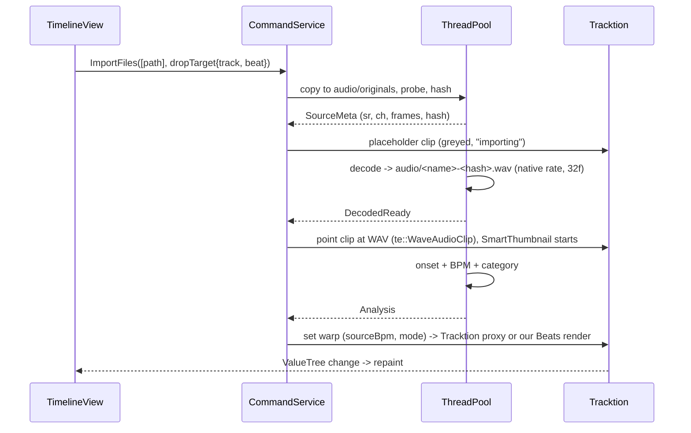

# Sampler DAW: Technical Design

| | |
|---|---|
| Status | Draft v2 (2026-10-08) |
| Inputs | `concepts/index.html`, `project/Main.dc.html` (Session view), `project/Arrangement.dc.html`, `project/Sampler.dc.html` (Sample editor), `project/canvas.json`, `tech-comparison-rust-vs-cpp.md` |
| Audience | Solo hobbyist developer, Windows 10 |
| Working product name | "Sampler" (from the mock logo) |
| Previous version | v1 (Tauri 2 + Rust + React) is kept in `archive/technical-design-v1-tauri-rust.md` |

### Update 2026-10-08 (decisions on Q6 and Q8)
- **No Mac available: macOS is deferred (TODO-MAC).** Windows is the only built and verified platform for now; the code stays portable. Details in 12.1, goal 9, M0, M4, R17 and Q8.
- **Audio drivers:** the Focusrite interface is not connected yet, so development uses the standard Windows drivers (WASAPI). ASIO is deferred. See Q6.

### Changes in v2
- **Stack changed** from Tauri 2 + Rust core + React UI to **C++20 with JUCE 8 (engine and UI) and Tracktion Engine 3** as the playback and editing engine. See `tech-comparison-rust-vs-cpp.md` for the reasoning.
- **New hard requirements:** host **Native Instruments Maschine** and other third-party VST3/AU plugins, MIDI, multi-output routing, and drag-based editing including **drag to reorder tracks** and drag out of the app (section 2.6).
- **The mocks are drawings only.** They define layout and behaviour, not technology. The UI is built with JUCE Components, styled after the drawings.
- **Windows + macOS parity** was a hard requirement; macOS is now deferred until a Mac is available (TODO-MAC, section 12.1). Windows is built and verified first, and the code stays portable.
- **New hard requirement: capture computer audio.** Record whatever the computer is playing (for example a YouTube video in the browser) straight into the project (section 2.7, 6.4). Added to the MVP as milestone M2b.
- **Roadmap reordered:** plugin hosting + MIDI (with Maschine as the acceptance test) moves from M10/M11 to M5, right after the MVP.
- Removed v1 machinery that a single-process C++ app does not need: IPC commands, JSON patches, the document mirror in the UI, the telemetry channel and the `peaks://` protocol.

---

## 1. Overview, goals, non-goals

**Product in one sentence:** a desktop DAW for Windows (macOS later, TODO-MAC) where you drop in an audio file (wav/mp3/flac/ogg/m4a) or record what the computer is playing (e.g. a YouTube video), chop it into slices in a sample editor, play the slices from pads, arrange slices and clips across several tracks, play third-party instruments such as Maschine, and export a new instrumental to WAV or MP3.

**Architecture in one sentence:** a single-process **C++20 JUCE 8** desktop app. **Tracktion Engine 3** owns the edit (tracks, clips, plugins, tempo, undo), real-time playback, plugin hosting and offline rendering. A thin **Sampler layer** on top adds what Tracktion does not have: the sample library, analysis, slicing, pads, the Beats warp mode and the Command API. The **UI is JUCE Components** drawn with a custom `LookAndFeel` after the mocks.

**Key design principles**
1. **Lean on Tracktion Engine; do not rebuild a DAW engine.** Playback, looping, fades, clip gain, reverse, time-stretch, mixer, meters, metronome, MIDI, plugin hosting, PDC, recording, automation and rendering all come from Tracktion. Our code covers the sampler-specific features and the UI.
2. **One command layer.** Every document change goes through a `Command` (section 8.4) that wraps Tracktion API calls in one undo transaction. The UI never edits the Tracktion model directly. This keeps undo, autosave and tests consistent, and gives one place to swap engine details.
3. **Real-time code is ours only where it must be.** We write two small real-time pieces: the `SlicePadPlugin` (pad voices, section 7.4) and level/position readers. Everything else heavy (analysis, Beats renders, import decoding) runs on worker threads and produces files that Tracktion plays.
4. **Audio files are never modified.** Every edit is metadata in the edit. Derived audio (decoded WAVs, Beats renders, slice renders, Tracktion proxies) lives in a disposable cache.

### Goals (MVP)
1. Import common audio formats by drag & drop or the browser. Files are copied into the project.
1b. **Capture computer audio**: press Record and record whatever is playing on the computer (browser, media player, another app) into a new source, a clip at the playhead, or both. Works on the user's Windows 10 without extra drivers (section 6.4).
2. Sample editor: auto-slice (Beat grid, Transient, Manual), per-slice pitch/gain/reverse/play mode, 4x4 pads played by mouse or keyboard.
3. Multi-track arrangement: place, move, trim, split, duplicate and delete clips, **drag tracks to reorder**, snap to grid, loop region, playhead.
4. Warp: fit a clip's source BPM to the project tempo (Re-pitch, Beats, Tones and Texture modes).
5. Mixer basics: volume fader, pan, mute, solo, peak meters per track plus master. Metronome.
6. Unlimited undo/redo, save/load, autosave and crash recovery.
7. Export: master to WAV (16/24/32f) and MP3, plus per-track stems.
8. Glitch-free playback on a stock Windows 10/11 machine and on macOS (Apple Silicon and Intel, macOS 13+). WASAPI shared mode (about 10 to 20 ms), **WASAPI exclusive and ASIO** (about 3 to 6 ms) on Windows; CoreAudio on macOS (about 5 to 10 ms at 256 frames).
9. **Supported platforms: Windows 10/11 x64 now; macOS 13+ (arm64 + x64, universal binary) is deferred until the developer has a Mac (TODO-MAC, section 12.1).** Until then only Windows is built, tested and verified, but the code stays portable (OS code only in `src/platform/`, no Windows-only calls elsewhere) so the Mac port is a bounded task. macOS 13+ matches Maschine 3's own minimum; system-audio capture on macOS needs 14.2+ (6.4).

### First release after MVP (M5): plugins and MIDI
Host third-party **VST3** (Windows, macOS) and **AU** (macOS) instruments and effects, with **Maschine 3** as the acceptance test: transport sync, MIDI in, up to 16 stereo outputs routed to mixer tracks, state saved in the project, editor window, offline render. See section 2.6.

### Later (the "path")
Session view clip launching, microphone/line-in recording through the audio interface, tempo automation, built-in effects and automation lanes, MIDI controllers for the pads, CLAP and ARA hosting, Ableton Link, stem separation.

### Non-goals
Video, notation, surround, collaboration and cloud, mobile, a browser/web build, a plugin *format* (we host plugins, we never ship one), VST2 hosting (Steinberg no longer licenses the VST2 SDK to new developers; Maschine 3 is VST3/AU/AAX anyway), AAX hosting (Pro Tools only), and Linux (JUCE and Tracktion support it, but it is not tested or packaged).

---

## 2. Requirements derived from the UX mocks

IDs are used throughout the document. Phase: **MVP**, **v1** (first releases after MVP), **Later**. The mocks are drawings: each row describes behaviour to build, and the "Design component" column names our C++ classes.

### 2.1 Global header (Session + Arrangement)

| ID | Mock element | Requirement | Design component | Phase |
|---|---|---|---|---|
| G1 | "Sampler" logo | App identity | `MainComponent` | MVP |
| G2 | Session / Arrange segmented toggle | Switch main view, keep transport running, keep the selection per view | `ViewRouter` | MVP (Arrange), v1 (Session) |
| G3 | Stop button | Stop transport. A second press returns to the start (or loop start) | `TransportBar` -> `te::TransportControl::stop` | MVP |
| G4 | Play button (highlighted while playing) | Toggle play from the current position. Shows state from the transport, not optimistic UI | `TransportBar`, `te::TransportControl::isPlaying` | MVP |
| G5 | Record button (red) | Start/stop recording. In the MVP it records **computer audio** (section 2.7); the small arrow next to it picks the capture source. From M8 it also records armed tracks from interface inputs | `CaptureService` (MVP), Tracktion recording (M8) | MVP (capture), Later (inputs) |
| G6 | TEMPO 120.00 | Project tempo 20 to 999 BPM, two decimals, edited by drag or typing | `Cmd::SetTempo` -> `te::TempoSequence` | MVP |
| G7 | TIME SIG 4 / 4 | Numerator 1 to 32, denominator 2/4/8/16. Drives the ruler, snap and metronome accent | `Cmd::SetTimeSig` -> `te::TimeSigSetting` | MVP |
| G8 | POSITION "5 . 2 . 3" | Show bars.beats.sixteenths (1-based) at 60 Hz. Click to type a position for locate | `PositionDisplay`, `te::TempoSequence` conversions | MVP |
| G9 | "Click" button | Metronome on/off. Accent on beat 1. Excluded from export unless chosen | `te::Edit::clickTrackEnabled` | MVP |
| G10 | "Loop" button (Arrange) | Toggle the arrangement loop. Playback wraps sample-accurately at the loop end | `te::TransportControl::looping`, loop range | MVP |
| G11 | "Snap: 1 bar" (Arrange) | Grid snap value: off, 1 bar, 1/2, 1/4, 1/8, 1/16, 1/32 and triplets. Hold Alt to bypass. Toolbar shows the current value | `SnapService` (UI) | MVP |
| G12 | "44.1 kHz · 5.8 ms" | Show the actual device sample rate and output latency. Click opens Audio Settings (device, driver type, buffer size, rate) | `AudioStatusButton`, `AudioSettingsDialog` (wraps `juce::AudioDeviceSelectorComponent`) | MVP |

### 2.2 Session view (`Main.dc.html`)

| ID | Mock element | Requirement | Design component | Phase |
|---|---|---|---|---|
| S1 | Sample browser search box | Search imported samples by name and tag, incremental, in memory | `LibraryIndex`, `BrowserPanel` | MVP |
| S2 | PLACES: All samples / Loops / One-shots / Recordings | Filter by category. Category comes from auto-classification (loop if 1 to 64 bars at the detected BPM, otherwise one-shot if under 2 s), user-editable. "Recordings" lists captured audio (2.7) | `SampleMeta.category`, `Classifier` | MVP |
| S3 | File rows with mini-waveform icon, name, tag | List samples with a real thumbnail, name and tag. Click previews through the audition path. Drag onto a track or slot to create a clip | `BrowserPanel` (`juce::ListBox`), `ThumbnailService`, `Audition` | MVP |
| S4 | "Drop audio here to start sampling" | OS file drop anywhere imports. Dropping on the drop zone also opens the Sample editor for that file | `ImportService`, `juce::FileDragAndDropTarget` | MVP |
| S5 | Track column header (colour, name) | Track has a name and a colour from a 12-colour palette. Double-click to rename | `te::AudioTrack` name/colour | v1 |
| S6 | Clip slots (filled / active / empty) | 2-D grid track x scene. A slot holds 0 or 1 clip. Click launches (quantised to 1 bar by default) or stops. States: stopped, queued (blinking), playing. One playing clip per track | `SessionGrid` over Tracktion's clip launcher (`te::ClipSlot`, `te::Scene`, `te::LaunchHandle`) | v1 |
| S7 | Scene launch buttons 1..5 | Launch every clip in a row. Empty slots in the row stop that track (Ableton semantics) | `te::SceneList` | v1 |
| S8 | Master column with "Stop all" | Stop all session clips (quantised) | `SessionGrid::stopAll` | v1 |
| S9 | Track mixer strip: M, S, R, fader, meter, "-4.5 dB" | Volume fader (-inf..+6 dB, 0 dB detent), peak meter (post-fader, with peak hold), dB readout, Mute, Solo (exclusive with Ctrl), Arm (Later) | `MixerStrip`, `te::VolumeAndPanPlugin`, `te::LevelMeasurer` | MVP (fader/M/S also in Arrange) |
| S10 | Master strip fader + meter | Master volume and meter, plus a clip indicator above 0 dBFS | `MasterStrip`, master `VolumeAndPanPlugin` | MVP |
| S11 | "+ Audio track" | Add an audio track (also in Arrange) | `Cmd::AddTrack` | MVP |
| S12 | Bottom detail panel: colour, clip name, "Drums · 4 bars", "Open in sample editor" | Inspector for the selected clip. Opens the Sample editor on the clip's source/slice set | `ClipInspector`, `ViewRouter` | MVP |
| S13 | WARP On toggle | Warp on: clip follows the project tempo. Off: plays at native speed | `ClipWarp.enabled` (section 7.6) | MVP |
| S14 | MODE: Beats / Tones / Texture / Re-pitch | Warp algorithm per clip (mapping in section 7.6) | `WarpService` | MVP (Re-pitch, Beats, Tones), v1 (Texture tuning) |
| S15 | BPM 90.00 | Clip *source* BPM, auto-detected and editable. Half/double buttons | `ClipWarp.sourceBpm`, `BpmDetector` | MVP |
| S16 | GAIN 0.0 dB | Clip gain -inf..+24 dB, applied in real time | `te::AudioClipBase::setGainDB` | MVP |
| S17 | LENGTH 4 bars | Clip length in musical time (editable) | clip position in beats | MVP |
| S18 | LOOP On | Clip loops its region within its length on the timeline or in the slot | `te::AudioClipBase` loop range | MVP |
| S19 | Clip waveform with bar ruler 1..4, grid and playhead | Detail waveform of the clip region with a beat grid and a live playhead when playing. Drag the edges to set region start/end. Click to audition from that point | `WaveformView` (shared component) | MVP |

### 2.3 Arrangement view (`Arrangement.dc.html`)

| ID | Mock element | Requirement | Design component | Phase |
|---|---|---|---|---|
| A1 | Bar ruler 1..16 | Musical ruler that adapts to zoom (bars, beats, ticks). Click to locate, drag for a time selection | `TimelineRuler` | MVP |
| A2 | Orange loop region over the ruler (bars 5 to 8) | Loop range with draggable edges and a draggable body, snapped. Brighter when loop is enabled | `LoopBrace`, `te::TransportControl::setLoopRange` | MVP |
| A3 | Track header: colour, name, M/S/R, dB | Same model as S5/S9. Compact strip with a volume readout that you can drag to change. **Drag the header to reorder tracks** (section 10.6) | `TrackHeader` | MVP |
| A4 | Track lanes with grid lines | Horizontal lanes, 112 px tall by default (resizable). Grid density follows zoom and snap | `TimelineView` | MVP |
| A5 | Clips: track colour, name, waveform thumbnail, ring when selected | Clip rectangles with a waveform. Select (click, Shift/Ctrl add, marquee), move (also across tracks), trim the left/right edge (non-destructive), split (Ctrl+E), duplicate (Ctrl+D), delete, copy/paste. No overlaps: a later clip truncates the earlier one (section 8.3) | `TimelineView`, commands in 8.4 | MVP |
| A6 | Same source reused ("Break 90" x4, "Keys Chop 1" x2) | Many clips reference one source file with no copying of audio | Tracktion clips reference files (7.1) | MVP |
| A7 | "Reverse Keys" clip | Per-clip reverse | `te::AudioClipBase::setIsReversed` | MVP |
| A8 | "+ Audio track" plus the hint "Drag a sample from the browser onto the timeline to create a clip" | Drop from the browser (or the OS) onto a lane creates a clip at the snapped position. Dropping below the last lane creates a new track | `TimelineView` as `DragAndDropTarget` + `FileDragAndDropTarget` | MVP |
| A9 | Playhead line over all lanes | Playhead at 60 fps. Follow mode (page scroll) is optional | `PlayheadOverlay` (`juce::VBlankAttachment`) | MVP |
| A10 | Bottom inspector: name, track, "Bars 1-4", GAIN, START, FADE IN, FADE OUT, waveform | Clip gain, timeline start (editable), fade in/out (0 to clip length), plus a waveform with fade curves drawn | `ClipInspector`, `te::AudioClipBase` fades | MVP |
| A11 | 16-bar view | Horizontal zoom (Ctrl+wheel, pinch, Z to zoom to selection) and scroll. Project length grows automatically | `Viewport` model | MVP |

### 2.4 Sample editor (`Sampler.dc.html`)

| ID | Mock element | Requirement | Design component | Phase |
|---|---|---|---|---|
| E1 | "< Session" back button | Return to the view you came from (Q9) | `ViewRouter::back()` | MVP |
| E2 | Title "Break 90", meta "4 bars · 90 BPM · 44.1 kHz · stereo" | Show source name, length in bars at the detected BPM, BPM, native sample rate and channels | `SampleMeta` | MVP |
| E3 | Audition button | Play the whole region (or the selected slice), independent of the transport | `Audition` | MVP |
| E4 | Slice mode: Beat / Transient / Manual | Choose the slicing algorithm. Switching modes regenerates markers. Manual keeps the existing markers and lets you edit them | `Slicer` (7.2) | MVP |
| E5 | Divisions 1/4, 1/8, 1/16, 1/32 | Grid division for Beat mode, relative to the source BPM and the downbeat offset | `Slicer::beatGrid` | MVP |
| E6 | Sensitivity slider 0 to 100 | Onset threshold for Transient mode | `OnsetDetector` | MVP |
| E7 | "Auto-slice" button | Run the chosen algorithm and replace the markers (undoable) | `Cmd::AutoSlice` | MVP |
| E8 | "16 slices" counter | Live slice count | derived | MVP |
| E9 | Slice strip 1..16 (selected one highlighted) | Clickable slice index strip above the waveform. Scrolls/zooms with the waveform when there are more than about 32 slices | `SliceStrip` | MVP |
| E10 | Waveform with markers and a highlighted selected slice | Zoomable waveform. Markers can be dragged (snap to zero crossing optional), double-click adds or removes a marker. Selected slice is shaded | `WaveformView` + `MarkerLayer` | MVP |
| E11 | 4x4 pads, keys 1234 / QWER / ASDF / ZXCV, pad 1 bottom-left (MPC layout) | Pad n triggers slice n. Mouse down/up and key down/up are delivered as note-on/off. Pad flashes on trigger. More than 16 slices: pad banks (Q8) | `PadGrid`, `SlicePadPlugin` (7.4), `KeyboardRouter` (pad scope) | MVP |
| E12 | "Click a pad or press its key to play a slice" | Pads also *select* the slice | UI state | MVP |
| E13 | Slice START / END ("1.3.1", "1.4.1") | Shown in source-relative bars.beats.sixteenths at the source BPM. Editable. Toggle to show samples/seconds | `Slice.start/end` (frames) | MVP |
| E14 | LENGTH "1 beat" | Derived length in musical units | derived | MVP |
| E15 | PITCH "0 st" | Transpose -24..+24 semitones (plus cents in v1) | `Slice.pitch` -> slice render (7.4) | MVP |
| E16 | GAIN "0.0 dB" | Per-slice gain | `Slice.gainDb` | MVP |
| E17 | REVERSE toggle | Per-slice reverse | `Slice.reverse` | MVP |
| E18 | PLAY MODE One-shot / Gate / Loop | One-shot plays to the end. Gate stops on release (with a release fade). Loop loops the slice while held | `SlicePadPlugin` voices | MVP |
| E19 | "Send slices to Session" | Turn slices into clips. Default (Q7): a new track named after the sample, one clip per slice. In Session it fills consecutive slots (adds scenes if needed). In Arrange a sibling action, "Slices to new track", places them back-to-back from the playhead | `Cmd::SlicesToTrack` | MVP (Arrange variant), v1 (Session) |

### 2.5 Implied by the mocks (not drawn but required)
Audio settings dialog (G12), project open/save/new, a menu bar or command palette, a playing state for audition and pads, an error toast on import failure, a progress indicator for long imports and renders, an export dialog, a plugin browser, and plugin editor windows. These are covered in sections 10, 11 and 12.

### 2.6 Plugins, MIDI and drag editing (new hard requirements, not in the mocks)

| ID | Requirement | Design component | Phase |
|---|---|---|---|
| P1 | Scan, list and load **VST3** (Windows, macOS) and **AU** (macOS) instruments and effects. Scanning runs **out of process** so a crashing plugin cannot take down the app; bad plugins are blacklisted | `PluginService` (`te::PluginManager`, `juce::KnownPluginList`, child-process scanner) | v1 (M5) |
| P2 | **Instrument tracks**: a track with an instrument plugin, MIDI clips and live MIDI input | `te::AudioTrack` + `te::ExternalPlugin` + `te::MidiClip` | v1 (M5) |
| P3 | **Transport sync** to plugins: playing state, tempo, time signature, PPQ position, bar start, loop range | Provided by Tracktion's plugin host (VST3 `ProcessContext`) | v1 (M5) |
| P4 | **MIDI in**: hardware MIDI devices and the app's own pads/keyboard routed to the selected instrument track; record MIDI clips | `te::MidiInputDevice`, virtual MIDI input | v1 (M5) |
| P5 | **Multi-output instruments**: activate up to 16 stereo outputs and route each to its own mixer track | Tracktion **Rack** wrapping the plugin, with one rack instance per output track (section 5.6) | v1 (M5) |
| P6 | **Plugin state** saved inside the project (can be several MB, e.g. a whole Maschine project) | Tracktion edit serialisation | v1 (M5) |
| P7 | **Plugin editor**: open as a floating window, or docked in the bottom panel; resizable; HiDPI aware | `PluginWindow` (`juce::DocumentWindow`), `DockedPluginView` | v1 (M5) |
| P8 | **Plugin delay compensation** and **offline render** of plugins (export, stems) | Tracktion graph PDC, `te::Renderer` | v1 (M5) |
| P9 | Accept files **dragged out of plugin windows** (Maschine exports patterns as audio or MIDI by drag) | `FileDragAndDropTarget` on timeline; `.mid` import creates a MIDI clip | v1 (M5) |
| P10 | Effects plugins on any track and the master (insert chain) | Tracktion plugin list per track | v1 (M5) |
| D1 | **Drag a track header to reorder tracks** (Arrange headers and Session columns) | `TrackHeader` drag + `Cmd::ReorderTrack` | MVP |
| D2 | Drag clips within and across tracks, trim edges, drag the loop brace | `TimelineView` | MVP |
| D3 | Drag from the browser or slice strip onto the timeline or a slot | `juce::DragAndDropContainer` | MVP |
| D4 | Drop files from the OS (Explorer/Finder) | `juce::FileDragAndDropTarget` | MVP |
| D5 | **Drag a clip or slice out** of the app as a WAV file (to Explorer or another app) | `DragAndDropContainer::performExternalDragDropOfFiles` | v1 |

### 2.7 Capturing computer audio (new hard requirement, not in the mocks)

Use case: play a clip on YouTube (or any app), press Record in the DAW, and get that audio as a new sample to chop and arrange.

| ID | Requirement | Design component | Phase |
|---|---|---|---|
| C1 | **Record what the computer is playing** on the selected output device (system loopback). No virtual cable or extra driver on Windows 10/11 | `CaptureService` + `WasapiLoopbackCapture` (6.4) | MVP |
| C2 | **Capture source menu** next to Record: "All computer audio (<device>)", "Only one app" (pick a running app, e.g. the browser; where the OS supports it), "Interface input" (M8) | `CaptureSourceMenu` | MVP (all audio), MVP where supported (one app) |
| C3 | **Don't record the DAW itself**: by default the capture excludes the DAW's own output. Where the OS cannot exclude it, the DAW mutes its own output during capture unless the user chooses "record with DAW playback" | `CaptureService` policy (6.4) | MVP |
| C4 | Destination: **"Recordings" in the browser** (always) and optionally **a clip on the selected track at the playhead** (when the transport is running or "place on timeline" is on) | `Cmd::AddCapturedSource` | MVP |
| C5 | Live **input meter** and a running waveform while recording; elapsed time; a "no signal" warning after 3 s of silence (the most common mistake: wrong output device) | `CaptureMeter`, `CaptureWaveform` | MVP |
| C6 | **Trim silence** at both ends (threshold -60 dBFS) and optionally **auto-open in the Sample editor** after stopping | `CaptureService` post-process | MVP |
| C7 | **Pre-roll buffer**: the last 5 s before pressing Record are kept, so the start of a phrase is not lost when you press Record late (option, default on) | ring buffer in `WasapiLoopbackCapture` | v1 |
| C8 | Recordings longer than 30 minutes stop automatically with a notice (matches the import cap) | `CaptureService` | MVP |
| C9 | **macOS parity**: capture via Core Audio process taps on macOS 14.2+ (all audio except the DAW, or one app). On macOS 13 to 14.1, the app explains how to use a virtual loopback device such as BlackHole, selected as "Interface input" | `CoreAudioTapCapture` | MVP |

**Maschine notes.** Maschine 3 ships as standalone, VST3 64-bit, AU 64-bit and AAX, requiring Windows 10+ or macOS 13+. In plugin mode it offers 16 stereo outputs and plays its patterns from host transport. NI hardware controllers talk to the plugin through NI's own background service, so the host needs no controller code. NKS browser integration needs an NI partnership and is out of scope.

---

## 3. Technology decisions

| # | Area | Decision | Rationale (short) | Rejected alternatives |
|---|---|---|---|---|
| T1 | App framework | **JUCE 8** (latest 8.x at M0), desktop app (`juce_add_gui_app`) | Mature audio, plugin hosting, device I/O, drag and drop and 2-D graphics in one framework. Used by many shipping DAWs and plugins | **Tauri 2 + Rust** (v1 design; plugin hosting immature in Rust, see comparison); **Qt** (no audio or plugin hosting, LGPL/commercial); **JUCE + WebView UI** (adds IPC and a second language; the mocks do not need a web engine) |
| T2 | Language | **C++20** (MSVC v143 on Windows, Apple Clang on macOS) | JUCE, Tracktion, VST3/AU SDKs and all audio libraries are native C++ | Rust (see comparison doc) |
| T3 | UI | **JUCE Components** with a custom `SamplerLookAndFeel` built from the mock's design tokens. Custom-painted timeline, waveforms, meters and pads. **Direct2D renderer** on Windows (JUCE 8 default), CoreGraphics on macOS | One language and one process. Every mock element (rectangles, text, meters, waveforms, pads) is plain 2-D drawing | Web UI in a WebView (see T1); JUCE OpenGL renderer (kept as the upgrade path if profiling demands it) |
| T4 | Engine | **Tracktion Engine 3** (`tracktion_engine` module, latest 3.x at M0) | Gives the edit model, transport, clips, warp/stretch, mixer, meters, metronome, MIDI, plugin hosting, racks, PDC, recording, automation, clip launcher and offline rendering. Months of engine work avoided | **Custom JUCE engine** (v1 section 5 ported to C++; kept as the fallback if the M0 spike shows Tracktion does not fit); **JUCE `AudioProcessorGraph` alone** (no timeline, clips or edit model) |
| T5 | Audio I/O | **JUCE `AudioDeviceManager`** via Tracktion's `DeviceManager`: **WASAPI shared + exclusive** and **ASIO** on Windows, **CoreAudio** on macOS | All three Windows driver types without extra code. ASIO needs the Steinberg ASIO SDK (`JUCE_ASIO=1`), dual-licensed GPLv3 / proprietary since Oct 2025 | PortAudio, RtAudio (no advantage over JUCE) |
| T5b | Computer-audio capture | **Own capture classes outside JUCE's device layer.** Windows: **WASAPI loopback** (`IAudioClient` on the render endpoint with `AUDCLNT_STREAMFLAGS_LOOPBACK`, event-driven, shared mode), plus **process loopback** (`ActivateAudioInterfaceAsync` with `AUDIOCLIENT_PROCESS_LOOPBACK_PARAMS`, include one app or exclude our own process) when the OS supports it. macOS 14.2+: **Core Audio process taps** (`CATapDescription` + aggregate device). Captured audio goes straight to a WAV file, not through the playback graph | JUCE does not support loopback officially (a community fork exists). Endpoint loopback works on every Windows version since Vista, including the user's Windows 10 22H2. Recording to a file avoids clock-drift handling between the capture stream and the output device | Virtual cables (VB-Cable, Voicemeeter, BlackHole) as the main path: extra install and routing setup for the user. Kept as a documented fallback ("Interface input"). Stereo Mix (many drivers no longer provide it). Screen-capture APIs (heavier, need screen-recording permission) |
| T6 | Decoding | **JUCE formats**: WAV, AIFF, FLAC, Ogg Vorbis, MP3 (`JUCE_USE_MP3AUDIOFORMAT`). **M4A/AAC/ALAC**: `CoreAudioFormat` on macOS; on Windows a small **Media Foundation reader** of our own (`MFSourceReader`, about 300 LOC) unless JUCE's `WindowsMediaAudioFormat` covers it (check at M0). Opus via `libopusfile` (BSD) in v1 | No DLLs, permissive or platform licences. Imports are decoded once to WAV (6.1), so decoders only run at import time | **FFmpeg** (huge, LGPL/GPL; kept only as an optional user-supplied `ffmpeg.exe` fallback run as a subprocess) |
| T7 | Resampling | **Tracktion's built-in** sample-rate conversion during playback (quality setting per clip) and in the renderer. `juce::LagrangeInterpolator`/`WindowedSincInterpolator` or **r8brain-free** (MIT) for offline slice renders | Sources stay at their native rate; no resample-at-import step | libsamplerate (BSD, no gain over r8brain) |
| T8 | Time-stretch / pitch | **Tracktion `TimeStretcher`** with **Rubber Band** enabled (`TRACKTION_ENABLE_TIMESTRETCH_RUBBERBAND=1`, modes `rubberbandMelodic` / `rubberbandPercussive`) for Tones/Texture. **Own transient-segment renderer** for Beats. Varispeed for Re-pitch. **Signalsmith Stretch** (MIT) behind our `Stretcher` interface for slice renders and as the fallback if the app ever goes closed source | The app is GPL by default (T18), so Rubber Band's GPL licence fits and it is best-in-class | SoundTouch (bundled with Tracktion; LGPL, audible artefacts on polyphonic material; kept as the fast preview mode); élastique (commercial) |
| T9 | Waveforms | **Tracktion `SmartThumbnail`** (JUCE `AudioThumbnail` + disk cache) for clips and browser rows. Raw samples read through `AudioFormatReader` for deep zoom in the sample editor. Waveforms cached per clip as `juce::Image` tiles | Ready made, disk cached, works with proxies and reversed clips | Own min/max pyramid (v1 design; only if `SmartThumbnail` proves too slow at M2) |
| T10 | Analysis | **Own spectral-flux onset detector and BPM estimator** with `juce::dsp::FFT` (about 500 LOC). Tracktion's `TempoDetect` (SoundTouch BPM) as a second opinion | Small, well understood algorithms, testable in isolation | aubio (GPL-3, C); essentia (AGPL); ML beat trackers (heavy, Later) |
| T11 | Encoding | WAV via `juce::WavAudioFormat` (from `te::Renderer`). **MP3 via libmp3lame** (LAME 3.100, LGPL) linked through CMake, wrapped as our own `Mp3Writer` (JUCE's `LAMEEncoderAudioFormat` needs an external `lame.exe`, which we avoid). FLAC via `juce::FlacAudioFormat` in v1 | WAV and FLAC are built in. LAME is still the reference MP3 encoder | `shine` (LGPL, worse quality) |
| T12 | Lock-free messaging | `juce::AbstractFifo`-based SPSC queues for pad events (UI -> `SlicePadPlugin`). Atomics for anything we read from the audio thread. Tracktion's own mechanisms for everything else | Proven and minimal. No allocation and no locks on the audio thread in our code | `std::mutex` with `try_lock` (priority inversion risk) |
| T13 | Project format | **Folder bundle** `Name.sdaw/` containing `project.tracktionedit` (Tracktion's XML edit, which includes our `SAMPLER` subtree), `audio/` (copied originals + decoded WAVs), `cache/` (disposable) and `autosave/` | Human-readable XML, diffable, migratable. One file holds everything including plugin state. Audio travels with the project | Single zip (slow saves); SQLite (opaque); our own JSON alongside the edit (two sources of truth) |
| T14 | App prefs / library | `%APPDATA%\Sampler\` (`~/Library/Application Support/Sampler/` on macOS): `settings.xml` (`juce::PropertiesFile`), `library.xml` (sample index), `plugins.xml` (`KnownPluginList`). The library index is rebuilt from disk if lost | Simple, file-based, native to JUCE | SQLite (later, if the library grows past about 10k samples) |
| T15 | Undo/redo | **Tracktion's `juce::UndoManager`** on the edit's `ValueTree`. Every `Command` opens one transaction; gestures (fader or clip drag) keep one transaction open from mouse-down to mouse-up | `ValueTree` undo records property changes automatically, so there are no hand-written inverse operations to get wrong | Own immutable model compiled into Tracktion (two models to keep in sync) |
| T16 | Build & packaging | **CMake 3.28+ with Ninja**, dependencies as **git submodules** in `external/` (JUCE, tracktion_engine, Catch2, LAME, Rubber Band, Signalsmith). Static MSVC runtime. **Inno Setup** installer on Windows; signed, notarized **.app/.dmg** on macOS. GitHub Actions matrix CI on `windows-latest` and `macos-latest` | Standard JUCE CMake path. No Node or Rust toolchain | Projucer (CMake integrates better with CI and IDEs); NSIS (Inno is simpler for a single exe) |
| T17 | Testing | **Catch2** unit and property-style tests; **golden-render tests** via the headless `sampler-cli` (Tracktion `Renderer`, no device); ASan on Windows (MSVC `/fsanitize=address`) and **ASan + TSan on macOS CI**; an audio-thread allocation detector in debug builds (5.1) | Most tests run without audio hardware or UI | Manual listening only (not repeatable) |
| T18 | Licence of the app itself | **Private hobby project by default.** If published: **AGPLv3**, which is what the free licences of JUCE 8 (AGPLv3) and Tracktion Engine (GPLv3) together require. Closed source needs a JUCE licence *and* a Tracktion licence (Q2) | Keeps Rubber Band (GPL) and ASIO (GPLv3) usable | n/a |

---

## 4. System architecture

### 4.1 Process and thread view

```
 ┌──────────────────────────────── Sampler.exe (one process) ─────────────────────────────────┐
 │  MESSAGE THREAD (JUCE)                                                                      │
 │   ├─ UI Components: header, browser, timeline, session grid, sample editor, mixer, dialogs │
 │   ├─ CommandService ─ applies Commands to te::Edit inside UndoManager transactions         │
 │   ├─ te::Edit (ValueTree model) + SAMPLER subtree (sources, slice sets, library meta)      │
 │   ├─ ValueTree listeners -> UI repaints; WarpService/RenderScheduler react to clip changes │
 │   └─ 60 Hz VBlankAttachment: playhead, meters, pad flashes (read transport + LevelMeasurer)│
 │                                                                                             │
 │  AUDIO THREAD (device callback, MMCSS "Pro Audio" on Windows / audio workgroup on macOS)  │
 │   └─ Tracktion playback graph: clips, plugins (Maschine etc.), racks, mixer, master,       │
 │      click, SlicePadPlugin (ours) ◄── AbstractFifo pad events from the UI                  │
 │                                                                                             │
 │  BACKGROUND                                                                                 │
 │   ├─ Tracktion job threads: proxy renders (warp/reverse), thumbnails, file caching         │
 │   ├─ Our juce::ThreadPool (N-1 threads): import decode, analysis, Beats renders,           │
 │   │   slice renders                                                                         │
 │   ├─ Export thread: te::Renderer (offline, same graph, no device)                          │
 │   ├─ Capture thread (MMCSS "Capture"): WASAPI loopback / Core Audio tap -> lock-free ring  │
 │   │   -> ThreadedWriter -> audio/recordings/*.wav; meter + waveform peaks via atomics     │
 │   └─ Autosave timer (message thread) -> atomic file write                                  │
 └─────────────────────────────────────────────────────────────────────────────────────────────┘
   Child process: out-of-process plugin scanner (Sampler.exe --scan <plugin path>)
   Plugin editor windows: native top-level windows owned by the message thread
```

**Process boundaries:** one app process plus a short-lived scanner child process. Plugins run **in process**, as in most DAWs. A crashing plugin at play time takes the app down; autosave (9.4) limits the loss. Out-of-process plugin hosting is not planned (R13).

### 4.2 Ownership and threading rules
1. **The `te::Edit` is the single source of truth** for the document, including our `SAMPLER` subtree. It lives on the message thread.
2. **UI -> model:** components call `CommandService::apply(cmd)`. They never write to the `ValueTree` or call Tracktion editing APIs directly. Continuous gestures call `begin(gesture)`, `update(...)`, `commit()` and form one undo transaction. During a clip drag the timeline paints a preview and applies only on commit.
3. **Model -> UI:** components listen to the `ValueTree` (or Tracktion's change broadcasters) and repaint. No mirror, no patches.
4. **Model -> audio:** Tracktion rebuilds its playback graph off the audio thread when the edit changes and swaps it in safely. Fast parameters (volume, pan, mute, solo) go through Tracktion's automatable parameters, which are audio-thread safe.
5. **Audio -> UI:** read-only polling at 60 Hz: `TransportControl` position/state, `LevelMeasurer` clients for meters, atomics in `SlicePadPlugin` for pad flashes. Nothing on the audio thread calls into the UI.
6. **Workers -> model:** worker jobs never touch the edit. They post results to the message thread (`juce::MessageManager::callAsync`), where a Command or service applies them.

### 4.3 Sequence: drop file -> clip on timeline


---

## 5. Audio engine design

Tracktion Engine is the engine. This section defines how we configure and extend it, and the rules for the code we write.

### 5.1 Real-time safety rules (for our code)
Inside `SlicePadPlugin::applyToBuffer` and anything else we run on the audio thread:
- No heap allocation or free, no locks, no I/O, no logging (a lock-free log ring is allowed).
- No unbounded loops. Work is O(active voices x block size).
- Every buffer is preallocated in `initialise(sampleRate, blockSize)`.
- Slice buffers are reference-counted (`juce::ReferenceCountedObjectPtr` / `std::shared_ptr`); the last release never happens on the audio thread (retired buffers go back through a garbage FIFO to the message thread).
- **Debug allocation detector:** a global `operator new` hook checks a `thread_local` "in audio callback" flag. Our code asserts on allocation; allocations inside Tracktion or third-party plugins are logged with a stack trace, not asserted, because we do not control them.
- FTZ/DAZ are set by JUCE (`juce::ScopedNoDenormals`).
- Tracktion's CPU usage and xrun counts are shown in a debug overlay.

### 5.2 Graph and mixer topology
```
 Audio track:       [audio clips] ─► [insert plugins] ─► VolumeAndPan ─► LevelMeter ─► master
 Instrument track:  [MIDI clips + live MIDI] ─► [instrument plugin or Rack] ─► [inserts] ─► VolumeAndPan ─► LevelMeter ─► master
 Multi-out track:   (Rack output pair N of an instrument, see 5.6) ─► [inserts] ─► VolumeAndPan ─► LevelMeter ─► master
 Pad track (hidden): SlicePadPlugin (sample editor pads + audition) ─► master (not muted by solo)
 Master:            [master plugins] ─► master VolumeAndPan ─► master meter ─► device
 Click:             Tracktion click track (excluded from export unless "include click")
```
- Internal format: f32, Tracktion's standard stereo buses.
- Solo, mute, gain and pan smoothing, and PDC are handled by Tracktion.
- No clipping protection on master (true DAW behaviour). The meter shows overs. Export has optional normalisation.
- Built-in effects (EQ, compressor, reverb, delay) come from Tracktion's internal plugins in v1 (M9).

### 5.3 Time model
| Domain | Unit | Where used |
|---|---|---|
| Musical (UI, commands) | `te::BeatPosition` / `te::BeatDuration` (double beats); snap grids in beats | Clip start/length, loop range, snap, slice musical display |
| Edit time | `te::TimePosition` (seconds) | Tracktion's internal clip positions, transport |
| Source | frames at the source's native rate (`int64`) | Slice markers, clip source offsets (rate independent) |
| Wall-clock UI | ms | Playhead interpolation only |

- Conversions go through **`te::TempoSequence`**, which already supports multiple tempos, ramps and time signature changes. The MVP uses one tempo and one time signature; tempo automation (M10) needs no model change.
- **Tempo changes:** clips must keep their **beat** positions when the tempo changes. Verify Tracktion's behaviour at M0. If it keeps time positions instead, `Cmd::SetTempo` re-positions every clip by beat inside the same undo transaction.
- Position display (G8): `beats -> bar.beat.sixteenth` via `TempoSequence`, 1-based.

### 5.4 Transport and scheduling
- Play, stop, locate, loop, and sample-accurate loop wrapping are `te::TransportControl`. Stop pressed twice returns to start or loop start (our `TransportBar` logic).
- Clip edge declicking: Tracktion applies short fades at clip boundaries; we set a default 3 ms fade-in/out on every new clip as well (user fades are separate, 7.5).
- **Session launch (v1):** Tracktion's clip launcher (`te::ClipSlot`, `te::Scene`, `te::LaunchHandle`, launch quantisation). Our `SessionGrid` is a view over it. Verify maturity at M6.
- **Pads/audition:** see 7.4. Events are rendered at the next block start (at most one block of jitter), which is acceptable for live triggering.

### 5.5 Sample-rate handling
- Device rate is the user's choice (default: the device's current rate).
- Sources stay at their **native rate** as decoded WAVs. Tracktion resamples on the fly with the clip's resampling quality.
- A device rate change needs no re-render; Tracktion's proxies (warp/reverse) are regenerated by Tracktion if needed. Our Beats and slice renders are stored at the source rate, so they do not depend on device rate.
- Export renders at the chosen rate (44.1/48/96 kHz) through `te::Renderer` parameters.

### 5.6 Plugin hosting (M5)
- **Formats:** VST3 everywhere, AU on macOS. CLAP and ARA in Later. VST2 and AAX are out of scope.
- **Scanning:** `PluginService` scans the default VST3 folders (`C:\Program Files\Common Files\VST3`, `/Library/Audio/Plug-Ins/VST3`, AU registry) plus user folders, **in a child process** (`Sampler.exe --scan`), one plugin at a time with a timeout. Crashes and timeouts go on a blacklist. Results are saved to `plugins.xml`.
- **Instances:** `te::ExternalPlugin` on a track. State (P6) is serialised by Tracktion into the edit XML.
- **Multi-output (P5):** the instrument is wrapped in a **Tracktion Rack** whose outputs are the plugin's output buses. The main instrument track carries the rack with MIDI input; each extra output pair N gets an **output track** holding another instance of the same rack type set to output N (Tracktion's documented pattern for multi-out instruments). `Cmd::AddMultiOutTracks{track, count}` creates these tracks named "Maschine Out 2..16". Verify at M0 that the plugin runs once, not once per rack instance.
- **MIDI (P2, P4):** MIDI clips on instrument tracks; hardware MIDI inputs and a **virtual "Pads" MIDI input** that the sample editor pads and the computer keyboard can feed, so the pads can also play Maschine.
- **Editor windows (P7):** `PluginWindow` (a `juce::DocumentWindow` holding the plugin's `AudioProcessorEditor`), remembering position and size per plugin instance. A docked mode shows the editor inside the bottom detail panel. Window always stays on top of the main window but not of other apps.
- **Latency:** PDC by Tracktion. Track headers show plugin latency when it is non-zero.
- **Offline render (P8):** Tracktion's renderer runs plugins in offline mode. If a plugin misbehaves offline, the export dialog offers "render in real time".
- **Maschine acceptance test (M5 exit):** see section 15.

### 5.7 Metering
- Per track and master: **sample peak** (decayed in the UI at 20 dB/s with a 1.5 s peak hold) + **RMS** (300 ms) as a darker inner bar, post-fader, from `te::LevelMeasurer` clients polled at 60 Hz.
- Overload indicator latches at > 0 dBFS until clicked.
- True-peak and LUFS for export: v1 (optional in the export dialog).

### 5.8 Latency
- Reported latency (G12) = output buffer latency + device-reported latency from `AudioIODevice::getOutputLatencyInSamples()`.
- Defaults: **WASAPI shared**, 480 frames @ 48 kHz (10 ms). The mock's "5.8 ms" needs **WASAPI exclusive** (available from the MVP via JUCE) or **ASIO**.
- ASIO: buffer 64 to 1024 frames, chosen in Audio Settings.
- WASAPI exclusive mode locks the device: other apps (e.g. a browser playing YouTube) go silent. Computer-audio capture therefore needs shared mode or a separate device (6.4).
- Latency matters for pads, live MIDI into Maschine, and recording. Arrangement playback is compensated by Tracktion.

### 5.9 Offline render and export path
- `te::Renderer` renders the edit with the same graph used for playback, without a device, as fast as possible.
- For plugin-free projects, renders are deterministic for a given build and block size, which the golden tests (section 13) rely on. Projects with third-party plugins are not deterministic and are excluded from golden tests.
- Before rendering, export waits until Tracktion's proxy jobs and our `RenderScheduler` have no pending jobs.

---

## 6. Audio file pipeline

### 6.1 Import
1. **Accept:** OS drop (`FileDragAndDropTarget`), browser drag, or File > Import. Extensions: `wav, aif, aiff, flac, mp3, ogg, oga, m4a, mp4 (audio), aac, alac` (`opus` in v1). Anything else is offered to `ffmpeg.exe` if the user configured one.
2. **Probe** with the matching JUCE reader (format, sr, channels, length). For MP3 the length comes from a full scan. Reject files longer than 30 minutes in MVP with a clear error.
3. **Copy into project:** `audio/originals/<sanitised-name>-<hash8>.<ext>`, where the hash is BLAKE3 (C reference implementation) or SHA-256 (`juce::SHA256`) of the file bytes. Duplicates are deduplicated by hash. The original path is stored for reference only.
4. **Decode once** to `audio/<sanitised-name>-<hash8>.wav` (32-bit float, native rate, mono or stereo). **Clips always reference the decoded WAV**, which gives Tracktion fast seeking and avoids compressed-format quirks (MP3 encoder delay is trimmed here using LAME/Xing gapless info; verify with a test file at M1).
5. **Thumbnail** (Tracktion `SmartThumbnail`), then **Analysis**, then **Classification**, as worker jobs with progress shown in the job indicator.
6. Channel policy: mono stays mono, stereo stays stereo, more than 2 channels are downmixed to stereo with a notification.
7. Failure handling: corrupt or unsupported files raise a toast with the format name. A partial decode keeps what decoded and shows a warning.

### 6.2 Waveform display
- Timeline clips and browser rows: `te::SmartThumbnail`, which caches to disk and follows Tracktion's proxies (reversed clips draw reversed).
- Warped clips: draw the source thumbnail mapped through the warp ratio, as Ableton does.
- Sample editor deep zoom (fewer than about 16 samples per pixel): read raw samples from the decoded WAV via `AudioFormatReader` and draw lines or sample dots.
- `ThumbnailService` caches rendered waveform tiles (`juce::Image`, 512 px wide) per (source, zoom bucket, height, colour) with an LRU budget of 256 tiles.

### 6.3 Analysis (feeds chopping and warp)
| Analysis | Algorithm | Output |
|---|---|---|
| Onsets (E6) | STFT 1024/hop 256 (Hann, `juce::dsp::FFT`) -> half-wave-rectified **spectral flux** (log-magnitude) -> adaptive threshold `median(win=±8 hops) * k + δ`, with `k, δ` mapped from Sensitivity 0..100 -> peak-pick with a 30 ms minimum gap -> **refine** each onset to the energy rise in a ±10 ms window, then snap to the nearest zero crossing within 1 ms | `onsets: vector<{frame, strength}>`. The sensitivity slider *filters* the precomputed set (instant feedback) |
| BPM (S15/E2) | 1) **Loop heuristic:** if the duration matches 1, 2, 4, 8 or 16 bars at 70 to 180 BPM (±0.5%), prefer it. 2) **Onset-strength autocorrelation** over 60 to 200 BPM with comb-filter scoring and octave-error penalties. 3) Tracktion `TempoDetect` as a tie-breaker. Keep the top 3 candidates | `bpm`, `confidence`, `alternatives` (UI shows ½ and ×2 buttons) |
| Downbeat / first beat | First strong onset within the first beat period. User-adjustable "1.1.1" marker in the sample editor | `beatOffsetFrames` |
| Category (S2/S3) | `loop` if the loop heuristic matched; `one-shot` if < 2 s with 1 to 3 onsets; `phrase` for a vocal-like spectral centroid with few onsets (low priority); `texture` for low onset density and long duration. All user-editable | `category`, `tag` |

Analysis results are stored in the `SAMPLER/SOURCE` node (9.2) and in `library.xml`.

### 6.4 Capturing computer audio (C1 to C9)

**Platform capabilities**

| Platform | "All computer audio" | "Only one app" / exclude the DAW | Notes |
|---|---|---|---|
| Windows 10 before build 20348 (incl. the user's 22H2, build 19045) | ✅ WASAPI endpoint loopback of the chosen output device | ⚠️ Not officially supported. The app **tries** process loopback at runtime (some Windows 10 builds accept it) and falls back to endpoint loopback | Endpoint loopback includes the DAW's own output if it plays to the same device (see policy below) |
| Windows 10 build 20348+ / Windows 11 | ✅ | ✅ Process loopback: include one app's process tree (e.g. the browser) or exclude the DAW's process | |
| macOS 14.2+ | ✅ Core Audio process tap (global tap excluding the DAW) | ✅ Process tap on one app | Needs the "System Audio Recording" permission (`NSAudioCaptureUsageDescription` in Info.plist); the first capture shows the OS prompt |
| macOS 13 to 14.1 | ⚠️ Via a virtual device (BlackHole) chosen as "Interface input" | ❌ | In-app help explains the setup |

**Pipeline**
1. The user picks a source (C2) and presses Record (G5, Ctrl+R).
2. `CaptureService` opens the capture stream on a dedicated capture thread (Windows: MMCSS "Capture" task; event-driven `IAudioClient` in shared mode at the endpoint's mix format, usually 48 kHz 32f stereo).
3. Frames go into a lock-free ring buffer (`AbstractFifo`, 10 s). A `juce::AudioFormatWriter::ThreadedWriter` drains it into `audio/recordings/rec-<timestamp>.wav` (32f, capture rate, native channels downmixed to stereo). The writer never blocks the capture thread; an overflow is counted and reported.
4. The capture thread also publishes peak/RMS and a coarse waveform (one min/max per 10 ms) through atomics for C5.
5. **Silent gaps:** WASAPI loopback delivers no packets when nothing is playing. The capture thread inserts silence based on the device clock (`AUDCLNT_BUFFERFLAGS_SILENT` packets and `QueryPerformanceCounter` position gaps), so pauses in the YouTube video stay as silence in the recording and timing is preserved.
6. On Stop: flush, trim silence (C6), then `Cmd::AddCapturedSource` imports the file through the normal pipeline (6.1, from step 4 on: thumbnail, analysis, classification) with category "Recordings". If "place on timeline" is on, the same command creates a clip on the selected track at the transport position where recording started.

**Not recording the DAW itself (C3)**
- If the platform supports exclusion (Windows process loopback, macOS taps), the DAW's own process is excluded. Default.
- Otherwise (endpoint loopback on older Windows 10), the default is **"mute DAW output while capturing"**: the master output is muted for the duration of the capture, and the transport keeps running so a recording started during playback stays in time. The user can switch to "record with DAW playback" to deliberately capture both.
- **Device conflicts:** endpoint loopback needs the output device in **shared mode**. If the DAW uses WASAPI **exclusive** mode on the same device, other apps (the browser) cannot play at all; the capture menu shows this and offers to switch to shared mode while capturing. ASIO on an interface while the browser plays through the system default device works: the user picks the system device as the capture source.

**Timing**
- Captured audio is not sample-synced to the transport (YouTube is not either). When "place on timeline" is used, the clip is placed at the record-start position minus the capture stream's reported latency (`IAudioClient::GetStreamLatency`) and can be nudged as usual.
- The file is recorded at the capture device's rate; Tracktion resamples it during playback, so there is no clock-drift handling.

**Legal note:** recording streamed content is for the user's own private use; YouTube's terms restrict downloading content. The app does not check this; the source app name and time are stored in the recording's metadata for the user's records (Q15).

---

## 7. Chopping/slicing & sampler design

### 7.1 Non-destructive model
```
Source (SAMPLER/SOURCE: original file, decoded WAV, analysis)
  └── SliceSet (one per Source; edited in the Sample editor)   markers: frames, mode, division, sensitivity
        └── Slice i = [marker i, marker i+1) + params {pitch, gainDb, reverse, playMode, fades}
te::WaveAudioClip (arrangement or session) ─ references the decoded WAV + source offset/length + clip params
                                          ─ custom properties: sourceId, warp {mode, sourceBpm}, origin {sliceSetId, index}
```
Audio files are never modified. Every edit is metadata in the edit. Derived renders are keyed by a content hash.

### 7.2 Slicing modes (E4 to E8)
- **Beat:** markers at `beatOffset + k * (divisionBeats * 60 / sourceBpm * sr)` across the region. Optional "snap to nearest transient within 20 ms" (v1).
- **Transient:** markers = onsets with `strength ≥ threshold(sensitivity)`, recomputed instantly from cached onsets. "Auto-slice" commits as one undoable command; the slider shows a ghost preview before commit.
- **Manual:** keeps the current markers. Double-click adds, drag moves, Delete or double-click on a marker removes. Alt-drag disables zero-crossing snap.
- The control that does not apply to the current mode is **disabled** (Q10a).
- Limits: at most 256 slices. Minimum slice length 5 ms.

### 7.3 Slices -> clips (E19)
"Send slices to Session/Arrange" **copies** each slice into an independent clip (source offset, length and params copied). Later edits to the slice set do **not** update clips. The clip keeps `origin {sliceSetId, index}` for display. A "re-link" command can be added later.

### 7.4 Pads (E11, E12, E18)
- 16 pads per bank, MPC layout (pad 1 bottom-left = `Z`). Bank buttons A to P when there are more than 16 slices.
- **`SlicePadPlugin`** is our own `te::Plugin` subclass on a hidden pad track routed to the master. It holds a pool of 16 voices. Each voice plays a **slice render buffer** (pitch, reverse and gain baked in) with the play mode's envelope. Oldest voice is stolen with a 3 ms fade; retriggering the same pad chokes its previous voice.
- **Triggering:** the UI pushes `{padOn/padOff, sliceKey, mode}` into an `AbstractFifo`. From M5 the plugin also accepts **MIDI notes** (notes 36 to 51 map to pads 1 to 16 of the current bank), so a MIDI pad controller can play the slices and pad performances can be recorded as MIDI clips.
- **Slice renders:** a param change re-renders the slice on the `ThreadPool` (Signalsmith for pitch, `std::reverse` for reverse; typically under 20 ms for slices under 2 s). Until the new buffer arrives, the old one keeps playing.
- **Keyboard scope:** pad keys are active only while the Sample editor has focus and no text field is focused. JUCE gives key-down via `keyPressed` and key-up via `keyStateChanged(false)` + `KeyPress::isKeyCurrentlyDown`; the `KeyboardRouter` tracks which pad keys are held and ignores auto-repeat. Losing focus sends all-pads-off.
- Velocity: 1.0 for mouse and keyboard; MIDI velocity from M5.

| Play mode | On press | On release | Retrigger |
|---|---|---|---|
| One-shot | start at slice start | ignored | choke previous + restart |
| Gate | start | release fade (default 10 ms, settable) | choke + restart |
| Loop | start, loop slice region (3 ms crossfade at the loop point) | release fade | choke + restart |

### 7.5 Fades, crossfades, reverse, gain
- **Declick fades:** 3 ms default fade in/out on every new clip.
- **User fades** (A10): Tracktion clip fade in/out with its curve types (linear by default, convex/concave/S-curve in v1). Real time, so dragging a fade is audible immediately.
- **Crossfades:** MVP has none (no overlaps, 8.3). v1 allows overlap regions using Tracktion's auto-crossfade.
- **Reverse:** `te::AudioClipBase::setIsReversed` (Tracktion renders a reversed proxy). For Beats mode, our renderer reverses the region before segmenting, so a reversed loop still lands on the grid.
- **Gain:** clip gain via Tracktion; slice gain baked into slice renders.
- **Envelopes:** MVP has fades only. Clip gain envelopes and automation lanes come with M9 (Tracktion automation curves).

### 7.6 Warp / time-stretch / pitch (S13 to S15, E15)

| Mock mode (S14) | Implementation | Pitch handling | Use for |
|---|---|---|---|
| **Re-pitch** | Tracktion clip with time-stretch **disabled** and speed ratio `projectTempo / sourceBpm` (varispeed) | Pitch follows speed. Transpose = extra speed ratio | Vinyl/sampler style, artefact-free |
| **Beats** | **Our `BeatsRenderer`**: split the region at onsets (or a 1/16 grid if there are none), place each segment at its stretched musical position with no stretching inside segments, decay-fade the gaps, truncate overlaps with a 3 ms fade. Output is a WAV in `cache/beats_<key>.wav`; the clip plays it with time-stretch disabled. Re-renders when tempo, source BPM, region or reverse change | Signalsmith per segment if transpose ≠ 0 | Drums and breaks (the core use case) |
| **Tones** | Tracktion auto-tempo clip with `TimeStretcher::rubberbandMelodic`, rendered as a Tracktion **proxy** (`setUsesProxy(true)`) | Built-in pitch shift | Melodic, polyphonic material |
| **Texture** | `TimeStretcher::rubberbandMelodic` with a smoother window setting, or Signalsmith with a larger block (~200 ms) via the Beats-style render path if Rubber Band settings are not exposed (decide at M4) | same | Pads, ambience |
| Warp **off** | No time change; clip length = natural length at the current tempo | Varispeed if transpose ≠ 0 | One-shots |

- **`WarpService`** listens for changes to clip warp settings, project tempo and source BPM, and either reconfigures the Tracktion clip (Re-pitch, Tones, Texture) or schedules a `BeatsRenderer` job (Beats).
- **Pending renders:** while a Beats render is pending, the clip plays its previous render (stale but in time) or, if none exists, falls back to Re-pitch, and swaps when ready. Renders are prioritised: visible and playing clips first.
- **Cost:** a 4-bar loop renders in about 10 to 50 ms; a 3-minute track in a few seconds (measure at M0).
- **Warp markers:** MVP uses `beatOffset` + `sourceBpm` (linear map). v1 adds user warp markers using Tracktion's `WarpTimeManager` for Tones/Texture, and the same marker list as segment anchors in `BeatsRenderer`.
- **Real-time stretch:** Tracktion supports real-time stretching (`setUsesProxy(false)`), which tempo automation (M10) will use for Tones/Texture clips.

---

## 8. Arrangement & multi-track model

### 8.1 Entities
- **Track** = `te::AudioTrack` (name, colour, volume/pan via `VolumeAndPanPlugin`, mute, solo, arm, height in our UI state, plugin list). Track kinds in our UI: **Audio**, **Instrument** (has an instrument plugin), **Multi-out** (rack output N of an instrument), and hidden **Pad**. Folder/group tracks Later.
- **Clip** = `te::WaveAudioClip` (audio) or `te::MidiClip` (MIDI, M5), plus our custom properties: `sourceId`, `warp {enabled, mode, sourceBpm, markers}`, `pitchSt`, `origin`.
- **Transport/edit state:** `TempoSequence` (tempo, time signature), loop range, click enabled, snap (our UI setting stored in `SAMPLER/UI`).

### 8.2 Grid snapping
- Snap values: Off, 1 bar, 1/2, 1/4, 1/8, 1/16, 1/32, plus triplets. **Adaptive** ("Snap: auto") picks the finest grid line at least 8 px apart at the current zoom (v1 default; MVP uses the explicit value from G11).
- Snapping applies to clip start (moves keep the relative offset of a multi-selection), trim edges, loop region, split position and drop position. Alt bypasses snapping.

### 8.3 Overlap policy
Within one track, clips never overlap. Moving or pasting clip B onto clip A **trims A** (or splits A when B is inside it), done inside the same command so undo restores everything. Matches Ableton and keeps one clip per track playing at a time.

### 8.4 Editing operations (all are Commands)
| Command | Notes |
|---|---|
| `AddTrack{kind}`, `DeleteTracks`, `ReorderTrack{id, newIndex}`, `RenameTrack`, `SetTrackColor` | `ReorderTrack` is driven by header drag (D1) |
| `SetTrackParam{vol,pan,mute,solo,arm}` | Gestures form one transaction |
| `CreateClipFromSource{source, track, beat, region?}` | from browser or OS drop (A8) |
| `MoveClips{ids, dBeats, dTrack}` | applies the overlap policy |
| `TrimClip{id, edge, newBeat}` | left trim moves the source offset through the warp ratio |
| `SplitClips{ids, beat}` | two clips sharing the source |
| `DuplicateClips{ids}` | placed right after the selection's end |
| `DeleteClips`, `PasteClips{beat, track}` | internal clipboard holds serialised clip `ValueTree`s |
| `SetClipParams{id, partial}` | gain, fades, reverse, warp, loop, length, pitch |
| `SetLoop`, `SetTempo`, `SetTimeSig`, `SetSnap` | |
| `AutoSlice`, `SetSliceMarkers`, `SetSliceParams`, `SlicesToTrack` | sample editor |
| `AddPlugin{track, desc, index}`, `RemovePlugin`, `MovePlugin`, `SetPluginBypass` | M5 |
| `AddInstrumentTrack{desc}`, `AddMultiOutTracks{track, count}` | M5 (Maschine) |
| `ImportMidiFile{path, track, beat}` | M5 (P9) |
| `AddCapturedSource{file, meta, placeOnTimeline?, track, beat}` | after a capture stops (2.7). Starting/stopping capture is not undoable; adding the result is |
| `ConsolidateClips` (v1) | render the selection to a new source |

`CommandService::apply(cmd)` = `undoManager.beginNewTransaction(label)` (unless a gesture transaction is open) -> `cmd.apply(edit)` -> post-conditions checked in debug builds (no overlaps, regions within source bounds, ids unique) -> mark dirty.

Selection lives in **UI state** (`SelectionModel`, not undoable). After undo it is restored by mapping clip ids that still exist.

### 8.5 Undo/redo
- Tracktion's `UndoManager` records every `ValueTree` change inside a transaction.
- **Coalescing:** gestures keep one transaction from mouse-down to mouse-up. Repeated `SetTrackParam` on the same target within 500 ms join the previous transaction.
- Depth: limited by memory budget (`UndoManager` max actions, default 500 transactions). Not persisted across sessions in MVP.
- **Non-undoable:** transport play/stop/seek, zoom/scroll/selection, audition, view switches, render cache state, plugin *parameter* tweaks made inside a plugin's own editor (they are captured in plugin state on save, as in most DAWs).
- Import is undoable (removes the clip and source reference). Files stay in `audio/` until "Clean up unused media".

---

## 9. Data model & project file format

### 9.1 Bundle layout
```
MyBeat.sdaw/
  project.tracktionedit     # authoritative XML (te::Edit), written atomically (tmp + flush + rename)
  audio/
    originals/              # copied source files, never modified
      break-90-3fa1c2d9.wav
      dusty-keys-91bb03e0.mp3
    recordings/             # captured computer audio (2.7), never modified
      rec-20261008-213012.wav
    break-90-3fa1c2d9.wav   # decoded 32f WAV that clips reference
    dusty-keys-91bb03e0.wav
  cache/                    # disposable; safe to delete; rebuilt on demand
    thumbnails/  proxies/  beats_<key>.wav  slices/<key>.wav
  autosave/
    project.autosave.tracktionedit   # 2 s after the last edit (debounced), at least every 60 s if dirty
    project.<timestamp>.tracktionedit  # rolling 10 backups, one per manual save
```
- File references inside the edit are **relative to the bundle**, resolved through the edit's file path resolver. Verify at M0 that a moved bundle reopens without missing files.
- Tracktion proxy and thumbnail locations are redirected into `cache/` (configure via the engine's `PropertyStorage`/temp directory; verify at M0).

### 9.2 The `SAMPLER` subtree (our data inside the edit)
```xml
<EDIT ... >                                      <!-- Tracktion's own content: tracks, clips, plugins, tempo -->
  <SAMPLER schemaVersion="1" appVersion="0.3.0">
    <SOURCE id="src_3fa1c2d9" original="audio/originals/break-90-3fa1c2d9.wav"
            decoded="audio/break-90-3fa1c2d9.wav" originalPath="C:/Users/me/Samples/break 90.wav"
            hash="blake3:3fa1c2d9e0..." sampleRate="44100" channels="2" frames="470400"
            bpm="90.0" bpmConfidence="0.93" beatOffset="112" category="loop">
      <SLICESET mode="beat" division="1/16" sensitivity="60" markers="112 29512 58912 88312">
        <SLICE pitch="0" gainDb="0.0" reverse="0" playMode="oneshot"/>
        <SLICE pitch="0" gainDb="-2.0" reverse="1" playMode="gate"/>
        <SLICE pitch="3" gainDb="0.0" reverse="0" playMode="oneshot"/>
      </SLICESET>
    </SOURCE>
    <UI view="arrange" zoomPxPerBeat="24" scrollBeats="0" snap="1bar"/>
  </SAMPLER>
</EDIT>
```
Clips carry our extra properties directly on Tracktion's clip node, for example `sampler_sourceId="src_3fa1c2d9" sampler_warpMode="beats" sampler_sourceBpm="90.0"`. Tracktion preserves unknown properties on round trip (verify at M0; if not, store them in `SAMPLER/CLIPMETA` keyed by clip id).

### 9.3 Versioning & migration
- Tracktion upgrades its own edit format when it loads older edits.
- `SAMPLER@schemaVersion` is an integer, bumped on any breaking change to our subtree. On load, `migrate_vN_to_vN1(ValueTree&)` functions run in sequence. Each migration has a fixture test (`tests/migrations/vN.tracktionedit` -> expected vN+1).
- A file with a newer `schemaVersion` is refused with "created by a newer version". It is never opened lossy.

### 9.4 Autosave & recovery
- Autosave writes `autosave/project.autosave.tracktionedit` atomically when dirty: 2 s after the last edit, and at least every 60 s. Plugin states are included (they are part of the edit), so a plugin crash loses at most about 60 s of work.
- On open, if the autosave is newer than `project.tracktionedit`, the app offers "Recover unsaved changes?".
- On startup after a crash (a lock file `.sdaw.lock` with the PID is present and the PID is not running), the app offers to reopen the last project with recovery. If the crash happened while a plugin was being loaded, the app offers to open the project with that plugin bypassed.

---

## 10. UI architecture

### 10.1 Component tree
```
MainWindow (juce::DocumentWindow, native title bar)
 └─ MainComponent  (juce::DragAndDropContainer, ApplicationCommandTarget)
     ├─ HeaderBar: Logo, ViewToggle(G2), TransportBar(G3–G5) + CaptureSourceMenu(C2), TempoField(G6), TimeSigField(G7),
     │             PositionDisplay(G8), ClickToggle(G9) | LoopToggle(G10), SnapMenu(G11) | AudioStatusButton(G12)
     ├─ BrowserPanel (S1–S4): SearchBox, PlacesList, SampleList (juce::ListBox, virtualised) | PluginBrowser (M5)
     ├─ MainView
     │   ├─ SessionView (v1): SessionGrid, SceneColumn, MasterColumn, MixerStrips
     │   └─ ArrangementView: TrackHeaderList (drag-reorder) + TimelineRuler + TimelineView + PlayheadOverlay
     ├─ DetailPanel: ClipInspector (S12–S19 / A10) + WaveformView | DockedPluginView (M5)
     ├─ SampleEditor (full view): Toolbar(E4–E8), SliceStrip(E9), WaveformView+MarkerLayer(E10),
     │                            PadGrid(E11), SliceInspector(E13–E18), SendSlices(E19)
     └─ Overlays: Toasts, JobProgress, CapturePanel (meter, live waveform, elapsed time, C5)
 Dialogs: AudioSettingsDialog, ExportDialog, RecoveryDialog, PluginScanDialog (M5)
 PluginWindow × n (M5)
```

### 10.2 Look and feel
- `SamplerLookAndFeel : juce::LookAndFeel_V4` with colours from the mock tokens: `bg #17181b`, `panel #202125`, `raised #27282d`, `border #34353b`, `text #ececef`, `muted #a1a2ab`, `accent #ff7a3d`, track palette `#ff8f5a #4fd1c5 #b9a2ff #f0d65f …`.
- **IBM Plex Sans/Mono embedded** as binary data (`juce_add_binary_data`); no runtime font downloads.
- A small set of reusable widgets is built first (M1): `Knob`, `Fader`, `Meter`, `Pad`, `ToggleButton`, `SegmentedControl`, `ValueField` (drag or type), `Toast`. Every view is assembled from these.
- HiDPI: JUCE scales automatically; all custom painting uses float coordinates.

### 10.3 State and updates
| State | Lives in | Updates UI by |
|---|---|---|
| Document | `te::Edit` + `SAMPLER` subtree | `ValueTree::Listener` / Tracktion change broadcasters -> `repaint()` of the affected component |
| UI state | `UiState` (view, zoom/scroll, focused panel, pad bank, drag previews) and `SelectionModel` | `juce::ChangeBroadcaster` |
| Real-time readouts | Transport position, meters, pad flashes | One `VBlankAttachment` per window polling at display rate; components repaint only the changed region |
| Jobs | `JobRegistry` (import, render, export, scan progress) | `ChangeBroadcaster` |

Rule: structural repaints happen only on document or UI changes. Anything that moves at 60 Hz (playhead, meters, pad flashes) repaints a small dirty rectangle.

### 10.4 Keeping the timeline and waveforms at 60 fps
- **Layers as components:** `TimelineView` (grid + clip bodies + waveforms, repainted on doc/zoom/scroll change), a transparent `SelectionOverlay` (marquee, drag ghost, snap guides) and `PlayheadOverlay` (one line; `setOpaque(false)`, repaints a 2 px strip).
- **Waveform tiles:** cached `juce::Image` tiles (6.2). Zooming shows scaled stale tiles immediately, then swaps in fresh tiles.
- **Culling:** only clips intersecting the viewport are painted; per-track clip lists sorted by start (binary search).
- **Renderer:** Direct2D on Windows (JUCE 8). Budget: under 8 ms per frame while scrolling 200 visible clips. Profile at M2. If it is exceeded, attach a `juce::OpenGLContext` to the timeline only.

### 10.5 Zoom & scroll
- `Viewport {pxPerBeat, scrollBeat, scrollY}`. Ctrl+wheel zooms around the mouse X. Wheel scrolls vertically and Shift+wheel horizontally. Touchpad pinch (`mouseMagnify`) maps to zoom. Z zooms to the selection, Shift+Z zooms to the full project. Zoom range from 1 px/bar to about 1 px/sample (sample editor).
- **Follow playhead** (toggle F): page-flip when the playhead leaves 90% of the view.

### 10.6 Drag & drop
| Interaction | Mechanism |
|---|---|
| Move/trim clips, drag loop brace, marquee (D2) | `mouseDown/Drag/Up` in `TimelineView` with hit-testing (body, left edge, right edge, fade handles). Drag preview painted in `SelectionOverlay`; one Command on mouse-up |
| **Reorder tracks** (D1) | Drag a `TrackHeader` vertically (start after 4 px movement). `TrackHeaderList` paints an insertion line between headers and auto-scrolls near the edges. On drop: `Cmd::ReorderTrack`. Same in Session columns horizontally. Multi-out tracks move with their instrument track as a group (M5) |
| Browser row / slice / plugin -> timeline or slot (D3) | `DragAndDropContainer::startDragging` with a description (`"sample:<id>"`, `"slice:<set>/<i>"`, `"plugin:<uid>"`) and a drag image. Targets implement `DragAndDropTarget` and show a snapped ghost clip while hovering. Dropping a plugin onto a track adds it; onto empty space creates an instrument track |
| OS files in (D4, P9) | `FileDragAndDropTarget` on `MainComponent`; hit-test the drop position: lane -> clip at the snapped beat, below lanes -> new track, browser -> import only, sample editor drop zone -> import + open editor. `.mid` files create MIDI clips (M5). Drops from plugin windows (Maschine drag-out) arrive the same way |
| Clip/slice out to Explorer (D5) | On drag leaving the main window, render the clip or slice to `cache/export/<name>.wav` (cached) and call `performExternalDragDropOfFiles` |

### 10.7 Keyboard shortcuts (defaults)
| Key | Action | Scope |
|---|---|---|
| Space | Play/Stop | global |
| Shift+Space | Play from selection start | global |
| Home / Enter | Return to start / loop start | global |
| L | Toggle loop | global |
| Ctrl+L | Set loop to selection | Arrange |
| M / S | Mute / Solo selected track | Arrange/Session |
| Ctrl+Z / Ctrl+Shift+Z (Ctrl+Y) | Undo / Redo | global |
| Ctrl+C / X / V / D | Copy / Cut / Paste / Duplicate | Arrange |
| Ctrl+E | Split at playhead or cursor | Arrange |
| Delete / Backspace | Delete | contextual |
| Ctrl+T | New audio track | global |
| Ctrl+Shift+T | New instrument track (M5) | global |
| Ctrl+S / Ctrl+Shift+S / Ctrl+O / Ctrl+N | Save / Save as / Open / New | global |
| Ctrl+Shift+R | Export | global |
| Ctrl+R | Record (start/stop capture) | global |
| Tab | Toggle Session/Arrange | global |
| 1–4, Q–R, A–F, Z–V | Pads (E11) | **Sample editor only** |
| Ctrl+wheel, Z, Shift+Z | Zoom | timeline/waveform |

Commands are registered with `juce::ApplicationCommandManager` (menu items and shortcuts in one place; Ctrl maps to Cmd on macOS). A `KeyboardRouter` with a scope stack (dialog > text input > sample editor > view > global) resolves conflicts between pad keys and global keys such as Z (zoom) and S (solo). Keys are not forwarded while a plugin editor window has focus.

---

## 11. Export

| Feature | Phase | Details |
|---|---|---|
| Range | MVP | Whole song (first clip start to last clip end + tail), loop region, or a custom bar range |
| Master WAV | MVP | 16-bit (TPDF dither on), 24-bit (dither optional), 32-bit float. Sample rate 44.1/48/96 kHz |
| MP3 | MVP | LAME CBR 128/192/256/320 or VBR V0/V2, ID3 title. 44.1 or 48 kHz |
| Stems | MVP | One file per track (post-fader, post-pan; option to ignore mute/solo) + optional master. Rendered with `te::Renderer` using a per-track mask, one pass per track (parallel where the CPU allows). Plugin-free stems sum to the master within rounding |
| Normalise | MVP | Peak normalise to -1.0 dBFS (render to a temp 32f WAV, scan, then scale + dither + encode) |
| Tail | MVP | +2 s, or until silence below -90 dBFS |
| Plugins in export | v1 (M5) | Offline render by default; "render in real time" option for plugins that misbehave offline |
| FLAC | v1 | `juce::FlacAudioFormat` |
| Loudness (LUFS) report / normalise | v1 | EBU R128 (`libebur128`, MIT) |
| Metronome in export | option | default off |

Pipeline: `ExportJob` waits until proxy and Beats renders are idle, runs `te::Renderer` to a temp file, then encodes (WAV writer / `Mp3Writer`), reporting progress. Cancel is supported. Output is written to `*.part` and renamed on success.

---

## 12. Project/repo structure, module boundaries, build & packaging

```
homemade-daw/
├─ CMakeLists.txt                  # top level: options (SAMPLER_ASIO, SAMPLER_RUBBERBAND), targets
├─ CMakePresets.json               # windows-msvc-debug/release, macos-debug/release
├─ cmake/                          # helpers: warnings, sanitizers, binary data, packaging
├─ external/                       # git submodules (pinned): JUCE, tracktion_engine, Catch2,
│                                  #   lame, signalsmith-stretch, r8brain-free, blake3, (asiosdk: user-supplied)
├─ src/
│  ├─ model/      # SAMPLER subtree wrappers (Source, SliceSet, Slice, ClipMeta), ids, migrations. No GUI, no audio thread
│  ├─ analysis/   # onset detector, BPM, classifier, slicer. Pure DSP on buffers, no JUCE GUI, no Tracktion
│  ├─ render/     # BeatsRenderer, SliceRenderer, Stretcher interface (Signalsmith), RenderScheduler
│  ├─ engine/     # EngineHost (te::Engine setup, device settings), SlicePadPlugin, Audition,
│  │              #   PluginService (scan, blacklist, windows), WarpService, telemetry readers
│  ├─ commands/   # CommandService and all Commands; the only code that edits te::Edit
│  ├─ io/         # ImportService (+ MF reader on Windows), Mp3Writer, ExportJob, bundle open/save,
│  │              #   autosave, LibraryIndex
│  ├─ ui/         # SamplerLookAndFeel, widgets/, header/, browser/, arrange/, session/, sampler/,
│  │              #   mixer/, dialogs/, plugins/, KeyboardRouter, UiState, SelectionModel
│  ├─ platform/   # ONLY place for OS-specific code: windows/ (WasapiLoopbackCapture, MF reader, MMCSS),
│  │              #   mac/ (CoreAudioTapCapture, permissions), behind ICaptureSource etc. (12.1)
│  └─ app/        # Main.cpp (JUCEApplication), MainWindow, command IDs, --scan child-process entry
├─ tools/sampler-cli/              # headless: `sampler-cli render proj.sdaw out.wav`, `analyze file.wav`
├─ tests/
│  ├─ unit/       # Catch2: model, commands, analysis, snapping, viewport math, keyboard routing
│  ├─ golden/     # *.sdaw fixtures + expected renders (git LFS)
│  ├─ migrations/
│  └─ audio-fixtures/  # tiny test files: wav/mp3/flac/ogg/m4a, mono/stereo, odd rates
├─ concepts/      # UX drawings
├─ technical design/
└─ .github/workflows/ci.yml
```

**Dependency direction (enforced by CMake target links):** `analysis` <- `render`; `model` <- `commands`; `analysis, render, model` <- `engine` <- `commands` <- `io` <- `ui` <- `app`. `analysis` and `render` do not link Tracktion, so they are testable on plain buffers. Only `commands` (and `io` for open/save) mutate the edit.

**Build:**
- Windows prerequisites: Visual Studio 2022 (Desktop C++ workload, MSVC v143), CMake 3.28+, Ninja, Git LFS. Optional: the Steinberg ASIO SDK (unpacked into `external/asiosdk`, then `-DSAMPLER_ASIO=ON`). No WebView2, Node or Rust.
- macOS prerequisites (deferred, TODO-MAC): Xcode 15+ (Command Line Tools are not enough for AU hosting and signing), CMake 3.28+, Ninja, Git LFS. macOS binaries can only be built on a Mac (your own, or a CI runner).
- Same commands on both platforms, different presets: `cmake --preset <windows-msvc-debug | macos-debug> && cmake --build --preset <same>`. Debug builds of Tracktion are slow for audio, so `tracktion_engine` and `src/engine` are built optimised (`/O2` or `-O2`) even in the debug presets.
- Windows release: `cmake --build --preset windows-msvc-release`, then `iscc installer/sampler.iss` produces `Sampler_x.y.z_x64-setup.exe` (static MSVC runtime, so no redistributable needed). Code signing is optional (SmartScreen warns without it).
- macOS release: `cmake --build --preset macos-release` produces a **universal** (arm64 + x86_64) `Sampler.app`, then `installer/make-dmg.sh` signs it with the hardened runtime and entitlements (12.1), notarizes it (`notarytool`) when an Apple Developer ID is configured, and builds `Sampler_x.y.z.dmg`.
- CI (GitHub Actions, on every push). **Until a Mac exists (TODO-MAC) only the `windows-latest` job runs; the macOS rows below are the target setup for later.** Target matrix `windows-latest` + `macos-latest` (arm64) builds Debug and Release, runs `ctest` (unit + golden + migrations) on both, ASan on both, TSan on macOS, builds the installer and the .dmg as artifacts, and runs the licence check over `external/` (THIRD-PARTY-NOTICES generated). **A red build on either platform blocks merging.**

### 12.1 Windows + macOS parity

> **TODO-MAC (decided 2026-10-08): the developer has no Mac.** Until one is available, milestones are verified on Windows only. Skipped for now: macOS CI runner, Core Audio tap capture (`CoreAudioTapCapture`), AU hosting, macOS permissions/entitlements, `.dmg` packaging, M0 Mac capture probe. Kept from day one so the port stays cheap: the portability code rules below, the `ICaptureSource` interface, `juce::File` paths, and `Mod` (not Ctrl) in shortcut tables. When a Mac becomes available: add the macOS CI job, implement the Mac column of the table, run the M0 checks on it, then restore the rule below.

**Rule (applies once a Mac exists; until then Windows only): every feature ships on both platforms in the same milestone.** A milestone is only done when its exit criteria pass on a Windows PC *and* a Mac (M0 to M4 included). Exceptions must be listed in the table below.

| Area | Windows | macOS | Shared code / notes |
|---|---|---|---|
| Audio I/O | WASAPI shared/exclusive, ASIO (optional) | CoreAudio | JUCE `AudioDeviceManager`; Audio Settings shows only the driver types the platform has |
| Computer-audio capture (2.7) | WASAPI endpoint + process loopback (`WasapiLoopbackCapture`) | Core Audio process taps on 14.2+ (`CoreAudioTapCapture`); BlackHole help on 13 to 14.1 | Common `ICaptureSource` interface; `CaptureService`, ring buffer, writer, UI are shared |
| Plugin formats | VST3 | VST3 + AU | JUCE/Tracktion; the plugin browser shows the format |
| Plugin architectures | x64 | Native arm64 on Apple Silicon (plugins must be arm64 or universal; Maschine 3 is), x86_64 on Intel Macs | Intel-only plugins on Apple Silicon are not supported (would need Rosetta for the whole app) |
| Decoding M4A/AAC/ALAC | Own Media Foundation reader | JUCE `CoreAudioFormat` | Both behind JUCE's `AudioFormatManager` |
| Real-time thread priority | MMCSS "Pro Audio" (via JUCE) | Audio workgroup (via JUCE) | Our capture thread: MMCSS "Capture" / workgroup join |
| Keyboard | Ctrl, Alt | Cmd, Option | `ApplicationCommandManager` `ModifierKeys::commandModifier`; shortcut tables use "Mod" |
| Menus | Menu bar inside the window | Global macOS menu bar (`MenuBarModel::setMacMainMenu`), app menu with About/Preferences/Quit | One `MenuBarModel` |
| File locations | `%APPDATA%\Sampler\` | `~/Library/Application Support/Sampler/` | `juce::File::userApplicationDataDirectory` |
| Default plugin folders | `C:\Program Files\Common Files\VST3` | `/Library/Audio/Plug-Ins/VST3`, `~/Library/Audio/Plug-Ins/VST3`, `/Library/Audio/Plug-Ins/Components` (AU) | `PluginService` per-platform list |
| Permissions | None | **System Audio Recording** (`NSAudioCaptureUsageDescription`) for capture, **Microphone** (`NSMicrophoneUsageDescription`) for interface inputs | Permission state checked before capture; link to System Settings if denied |
| Signing / entitlements | Optional Authenticode | Hardened runtime with entitlements: `com.apple.security.device.audio-input`, **`com.apple.security.cs.disable-library-validation`** (required to load third-party plugins signed by other developers, e.g. Maschine), `com.apple.security.cs.allow-jit` if a plugin needs it. Not sandboxed (a sandboxed DAW cannot load arbitrary plugins) | `installer/entitlements.plist` |
| Running unsigned builds | SmartScreen "More info > Run anyway" | Builds made on your own Mac run directly. Downloaded unsigned builds need System Settings > Privacy & Security > "Open Anyway" (macOS 15 removed the right-click > Open shortcut) | Notarize if the app is ever shared |
| Packaging | Inno Setup `.exe` | Universal `.app` in a `.dmg` | Version number from one CMake variable |
| Graphics | Direct2D | CoreGraphics (OpenGL fallback for the timeline on both) | Same painting code |
| Sanitizers in CI | ASan (MSVC) | ASan + TSan (Clang) | |

**Code rules:**
- Platform-specific code lives only in `src/platform/<windows|mac>/` (capture backends, Media Foundation reader, permission checks, file-location defaults) behind small interfaces. Everything else must compile unchanged on both.
- No `#ifdef _WIN32` / `JUCE_MAC` outside `src/platform/` and `CMakeLists.txt`.
- Paths are `juce::File` only (no hand-built separators). Text is UTF-8 everywhere; files are written with `\n` line endings.
- Project bundles (`.sdaw`) are cross-platform: a project saved on Windows opens on the Mac and vice versa, as long as the same plugins are installed. Missing plugins load as placeholders that keep their saved state (Tracktion does this), so nothing is lost when moving back. A golden test opens a fixture saved on each platform.
- Developer setup: the Mac is needed for day-to-day testing of audio, capture, AU plugins and permissions, not just for CI (Q8). Recommended rhythm: develop on Windows, pull and run on the Mac at least once per milestone and before closing any milestone.

---

## 13. Testing strategy

| Layer | What | How |
|---|---|---|
| Commands / model | Every command: invariants (no overlaps, regions within source bounds, ids unique), undo(apply(x)) == x on the serialised edit, save/load round trip | Catch2 with a seeded random command generator (property-style): random command sequences on random edits, invariant check after each step |
| Time | beats <-> seconds <-> bar.beat.sixteenth via `TempoSequence`; clips keep beat positions on tempo change | Unit tests |
| Analysis | Onsets, BPM, classifier on fixtures | Golden outputs; accuracy suite: BPM within ±1% on 30 labelled loops, onset F-measure ≥ 0.85 at sensitivity 60 (slow suite, `ctest -L slow`). Collect a personal labelled set (Q11) |
| Render | BeatsRenderer, SliceRenderer, Signalsmith wrapper | Bit-exact for deterministic code; tolerance tests for stretchers (RMS error < -60 dB vs golden) |
| Engine golden | Render plugin-free `*.sdaw` projects via `sampler-cli`, compare to stored WAVs (fixed block size): loop wrap, overlapping trims, fades, mute/solo, warp modes, stems sum ≈ master | `tests/golden` (git LFS) |
| RT safety | No allocation or lock in our audio-thread code | Debug allocation detector (5.1) + a pad stress test (1,000 random pad events per second for 60 s, offline) |
| Plugins (M5) | Scan, load, state round trip, offline render, multi-out activation | Integration tests against a **test plugin we build** with JUCE (multi-out instrument + effect, deterministic output). Maschine and other commercial plugins are tested manually (checklist), not in CI |
| I/O | Decode each fixture format; MP3 gapless trim; corrupt files; 8/16/24/32f WAV; mono/5.1; bundle move/reopen | Unit tests with tiny fixtures |
| Migrations | v(N) fixture -> v(N+1) expected | Snapshot tests |
| Capture | Ring buffer + writer under overflow, silence-gap insertion, trim, `AddCapturedSource` | Unit tests with a fake capture source feeding scripted packets (incl. gaps and silent flags). Manual checklist on real hardware: YouTube in Chrome/Edge (Windows) and Safari/Chrome (macOS), all-audio vs one-app, DAW excluded, 10-minute recording without dropouts |
| UI logic | Snapping, hit-testing, viewport math, keyboard routing, track-reorder index math, drop-target resolution | Catch2 on plain classes kept free of painting code |
| UI smoke | Launch app, import, slice, send to track, move clip, reorder track, undo, export | Scripted manual checklist per milestone (`docs/qa-checklist.md`, create at M2). JUCE has no Playwright equivalent; keep logic out of components so unit tests cover it |
| Manual | Listening checklist; latency check with a loopback cable (optional); Maschine checklist (section 15) | Per milestone |

---

## 14. Performance budget & risks

### 14.1 Budgets (target machine: 4-core 2016+ laptop, Windows 10)
| Item | Budget |
|---|---|
| Audio callback CPU at 16 audio tracks, 4 active clips each, 256-frame buffer, no plugins | < 20% of block time |
| Xruns during 10 min playback while editing | 0 at the default buffer |
| UI frame time while playing + scrolling 200 clips | < 8 ms (sustained 60 fps) |
| Playhead lag | < 1 frame + output latency compensation |
| Import 3-minute MP3 (copy + decode + thumbnail + analysis) | < 2 s to the first waveform, < 4 s total |
| Re-render on tempo change, 16 Beats-mode loop clips of 4 bars | < 500 ms until all are swapped |
| Command (intent -> repaint) | < 16 ms for typical edits |
| Cold start to empty project (plugin list cached) | < 2 s |
| RAM | < 300 MB + audio cache + plugins |

### 14.2 Top technical risks
| # | Risk | Impact | Mitigation |
|---|---|---|---|
| R1 | **WASAPI shared latency** (about 10 to 20 ms) feels sluggish for pads and live MIDI into Maschine | Medium | WASAPI exclusive and ASIO available from MVP via JUCE; show real latency honestly (G12) |
| R2 | **Tracktion fit**: its model, docs or behaviour (tempo changes, relative paths, custom properties, proxy locations, multi-out racks) do not match the design | **High** | M0 spike tests each assumption marked "verify at M0". Commands isolate Tracktion calls. Fallback: custom JUCE engine following the v1 engine design (archive section 5) |
| R3 | **Stretch quality** on drums | Medium | Beats mode does not stretch inside segments; Rubber Band percussive mode as an alternative |
| R4 | **JUCE UI build speed**: widgets take more code than HTML/CSS, and timeline UX is the biggest schedule item | Medium | Reusable widget set at M1; keep logic in plain classes; M2 timeline spike in M0 |
| R5 | **Long files / RAM** | Low | Tracktion streams from disk; 30-minute cap per import in MVP |
| R6 | **Beat/BPM detection errors** frustrate chopping | Medium | Confidence display, ½/×2 buttons, tap tempo, loop-length heuristic, manual mode |
| R7 | **Scope creep** (Session view, recording, plugins) stops the MVP from shipping | High | Strict milestone gates (section 15). Plugins wait for M5 even though Maschine is a hard requirement |
| R8 | **Licensing mistakes** (JUCE AGPLv3, Tracktion GPLv3, Rubber Band GPL, ASIO GPLv3, LAME LGPL) | Medium if distributed | Decide Q2 before publishing anything. CI licence check over `external/`, THIRD-PARTY-NOTICES |
| R9 | **C++ memory and threading bugs** (use-after-free, data races between message and audio threads) | Medium to high | Strict threading rules (4.2), ASan/TSan in CI, RAII and smart pointers only, warnings as errors, `clang-tidy` |
| R10 | **Device changes** (Bluetooth headphones, rate switch, USB unplug) | Medium | JUCE `AudioDeviceManager` change callbacks; auto-reopen of the default device; test with plug/unplug |
| R11 | Denormals/NaN cause CPU spikes or silence | Low | `ScopedNoDenormals`; NaN guard on the master in debug |
| R17 | **Platform drift**: the code silently becomes Windows-only while no Mac is available (TODO-MAC), making the later port expensive | Medium | Keep OS code in `src/platform/` behind interfaces; code review rule: no Win32 calls elsewhere. Once a Mac exists: CI builds and tests both on every push; parity rule and per-milestone check on real hardware (12.1); OS code isolated in `src/platform/` |
| R12 | **Tracktion lock-in and API churn** between major versions | Medium | Pin the submodule; upgrade deliberately between milestones; all Tracktion calls in `engine/` and `commands/` |
| R13 | **Third-party plugin crashes** take down the app (plugins run in process) | Medium | Out-of-process scanning, blacklist, autosave every 60 s, "open with plugin bypassed" recovery (9.4) |
| R15 | **Capture on older Windows 10 includes the DAW's own sound** (no process exclusion before build 20348) | Medium | Mute DAW output while capturing by default; runtime probe for process loopback; clear UI showing what is being captured |
| R16 | **Capture platform gaps**: macOS 13 to 14.1 has no native system-audio capture; macOS permission prompt denied; WASAPI exclusive mode silences other apps | Medium | BlackHole help page; permission check with a link to System Settings; capture menu warns about exclusive mode |
| R14 | **Maschine specifics**: multi-out via racks, very large state chunks, editor resizing, offline render behaviour | Medium | M0 spike runs the Maschine test early; real-time export fallback; our own JUCE test plugin covers the generic cases in CI |

---

## 15. Phased roadmap (solo dev, evenings/weekends; 1 "week" ≈ 10 to 12 focused hours)

| Milestone | Scope | Exit criteria | Effort |
|---|---|---|---|
| **M0 Spike** | CMake + JUCE 8 + Tracktion 3 build on **Windows** with CI green (macOS build, CI and Core Audio tap probe deferred, TODO-MAC). Play a WAV and an MP3. **Capture probe:** record 30 s of a YouTube video via WASAPI loopback on the Windows 10 PC (and test whether process loopback works on build 19045). Timeline component with 4 tracks, 50 clips with waveforms, scroll/zoom, clip drag, **track drag-reorder**. **Load Maschine 3 VST3**, open its editor, play from host transport at 120 BPM, 4 stereo outputs on separate tracks via racks, save/reopen with state, offline render 16 bars. Check every "verify at M0" item (tempo change keeps beats, relative paths, custom clip properties, proxy/cache location, multi-out racks). Benchmark Rubber Band and the Beats renderer | All items pass, or a written decision to use the custom-engine fallback for the failing area | 2 to 3 wks |
| **M1 Core + import** | App shell, `SamplerLookAndFeel` + widget set, bundle new/open/save, `CommandService` + undo, import pipeline, browser with search and categories, thumbnails, audition | Import 5 formats, save/reopen, undo works, waveforms drawn | 3 wks |
| **M2 Arrangement** | Timeline editing (move/trim/split/duplicate/delete, snap, marquee), track add/delete/**drag-reorder**, loop brace, mixer strips (vol/pan/M/S), meters, metronome, position display, golden tests | Build a 16-bar arrangement like the mock with 4 tracks; golden render tests pass | 4 to 6 wks |
| **M2b Capture** | `CaptureService`, WASAPI endpoint + process loopback (Windows), Core Audio process taps (macOS 14.2+), capture source menu, meter + live waveform, exclusion/mute policy, trim, Recordings place, place-on-timeline | On both platforms: play a YouTube video in the browser, record 1 minute, it appears in Recordings and as a clip at the playhead, with no DAW sound in it | 2 to 3 wks |
| **M3 Sample editor** | Onset + BPM analysis, Beat/Transient/Manual slicing, markers, slice strip, `SlicePadPlugin` + pads + keyboard, play modes, slice renders, Slices -> new track | Chop a break into 16, play the pads, lay the slices out in Arrange | 4 to 5 wks |
| **M4 Warp + export = MVP** | Warp modes (Re-pitch, Beats, Tones), source BPM, clip loop/length, fades UI, WAV/MP3/stems export, autosave/recovery, audio settings dialog (incl. WASAPI exclusive/ASIO), Windows installer (macOS .dmg deferred, TODO-MAC) | **MVP: import or capture -> chop -> arrange -> export an instrumental, end to end, on a Windows PC** | 3 to 4 wks |
| | | **MVP total** (Windows only; the earlier 20 to 26 weeks included about 10% for macOS parity, which is deferred, TODO-MAC. Re-estimate the port when a Mac is available) | **≈ 18 to 23 weeks (about 4.5 to 5.5 months part-time)** |
| **M5 Plugins + MIDI (Maschine)** | Plugin scanning (out of process), plugin browser, instrument tracks, effect inserts, MIDI clips and MIDI input, virtual Pads MIDI input, multi-out tracks, plugin windows (floating + docked), PDC display, plugin offline render, `.mid` drop import, D5 drag-out | **Maschine acceptance test:** (1) Maschine 3 loads on an instrument track; (2) its patterns play in sync with host transport and loop; (3) pads/MIDI keyboard play it; (4) 4+ outputs routed to separate tracks with their own meters and faders; (5) save, quit, reopen restores the full Maschine state; (6) export WAV and stems including Maschine; (7) a pattern dragged out of Maschine lands as a clip | 5 to 8 wks |
| M6 Session view | Clip slots, scenes, launch quantize, stop all, session/arrangement override, "Send slices to Session" (Tracktion clip launcher) | The mock's Session view works | 3 to 4 wks |
| M7 Polish | Texture mode, user warp markers, crossfades, adaptive snap, FLAC + LUFS export | | 3 wks |
| M8 Input recording | Microphone/line-in and MIDI recording from interface inputs into arrangement/slots, track arm, latency compensation (mostly Tracktion). Computer-audio capture is already in M2b | | 2 to 3 wks |
| M9 Effects + automation | Tracktion internal effects (EQ, compressor, delay, reverb), sends/returns, automation lanes, clip envelopes | | 3 to 5 wks |
| M10 Tempo map + real-time warp | Tempo automation and ramps, real-time stretch for Tones/Texture | | 2 wks |
| Later | CLAP and ARA hosting, Ableton Link, stem separation (ONNX Runtime, offline job), consolidate/bounce, groove/swing, time-sig changes | | — |

---

## 16. Open questions and concerns (prioritised; most blocking first)

Each item has a **Default** so work can proceed without an answer.

1. **Session view vs Arrangement as the MVP core.** The mocks make the Session view the home screen, but the stated goal (chop and rearrange into a new instrumental) is an Arrangement workflow. **Default:** Arrangement + Sample editor + export is the MVP (M0 to M4); Session view ships at M6. The app opens in Arrange until then.
2. **Licensing and commercial intent.** Will you ever distribute or sell this? With free licences, JUCE (AGPLv3) and Tracktion Engine (GPLv3) make a published app **AGPLv3**. Closed source needs a JUCE licence (free Starter tier up to $20k revenue, then Indie/Pro) **and** a Tracktion Engine licence (tiers at engine.tracktion.com), and Rubber Band would need a commercial licence or be swapped for Signalsmith. **Default:** private hobby project; if published, AGPLv3.
3. **Your C++ background.** The stack assumes you are comfortable with modern C++ (RAII, smart pointers, threads) or willing to learn it. **Default:** C++20 as designed; M0 doubles as the JUCE/Tracktion learning spike.
4. **Which Maschine and which hardware?** Maschine 3 or Maschine 2 (both have VST3 plugins; Maschine 3 needs macOS 13+), and which controller? Do you use multi-outs in practice, and how many? **Default:** Maschine 3 on Windows, up to 16 stereo outputs supported, 4 used in the acceptance test.
5. **Should Maschine come before the MVP?** If Maschine matters more than chopping, M5 can swap with M3/M4. **Default:** keep the order (the M0 spike already proves Maschine works), because the sampler workflow is the product's core.
6. **Latency expectations and hardware. (Decided 2026-10-08.)** The developer owns a Focusrite interface but it is not connected yet. For now development uses the **standard Windows audio drivers (WASAPI shared)** only. ASIO (Focusrite's driver) is a later option: needs the Steinberg ASIO SDK and `-DSAMPLER_ASIO=ON`, so it is not set up at M0. WASAPI exclusive stays available in Audio Settings. Revisit when the Focusrite is connected, especially for live pad and Maschine latency (R1).
7. **Recording (decided: computer-audio capture is in the MVP).** Remaining question: is microphone/line-in recording through an interface also needed soon? **Default:** M8. Track Arm (R) buttons are visible but disabled until then. Capture defaults to the system default output device and to excluding the DAW; do you want "place on timeline" on by default? **Default:** off (recordings go to the browser and open in the Sample editor).
8. **Platform targets. (Decided 2026-10-08: Windows first; macOS deferred, TODO-MAC.)** The developer has no Mac. The macOS target stays in the design as a later port; see the TODO-MAC note in 12.1 for what is skipped now and what is kept portable. Once a Mac is available, re-answer: (a) which macOS version (14.2+ is needed for native capture) and Apple Silicon or Intel? Capture, AU plugins, permissions and Maschine on macOS cannot be verified on CI. (b) Will you distribute the Mac build? That needs an Apple Developer account ($99/yr) for notarization. **Default:** unsigned personal builds, built on your own Mac.
9. **What does "Send slices to Session" create?** **Default:** a new track with one clip per slice. In Session it fills consecutive slots and adds scenes as needed; in Arrange it lays them back to back from the playhead. Slice clips are independent copies (7.3).
10. **More than 16 slices vs 16 pads.** **Default:** banks A to H of 16 pads with bank buttons above the grid; the slice strip scrolls.
11. **Navigation and context in the Sample editor.** **Default:** "Back" returns to the originating view. A compact transport is added to the editor header. Audition plays at the source tempo unless "Warp" is on for the opened clip.
12. **Mock contradictions to confirm.** (a) Sensitivity and Divisions shown together. *Default:* disable the irrelevant one. (b) Arrange inspector has fades but no Warp; Session inspector has Warp but no fades. *Default:* one unified inspector. (c) The mixers have no pan. *Default:* add a pan knob. (d) Project 120 BPM vs clip 90 BPM. *Default:* Warp on with Beats mode for loops, off for one-shots. (e) Slice START as bars.beats relative to the sample. *Default:* yes, with a toggle to seconds/samples. (f) The mocks have no plugin UI or track reordering affordance. *Default:* plugin browser as a second tab in the browser panel; drag the track header to reorder.
13. **Accuracy expectations for auto-BPM and auto-slice.** **Default:** optimise for loops and breaks; full songs rely on manual BPM/tap and Manual or Beat-grid slicing. Please collect 20 to 30 typical files as a test set.
14. **Copy-into-project policy.** Always copying (original + decoded WAV) uses disk. **Default:** always copy (dedupe by hash), with "Clean up unused media" in File.
15. **Copyright/sampling.** Recording a YouTube video for private sampling is common, but YouTube's terms restrict downloading, and publishing results may infringe copyright. **Default:** store `originalPath`, file tags, and for captures the source app and time, for your own records. No legal UI.
16. **Stem separation.** **Default:** out of scope until Later; use an external tool (UVR/Demucs) and import its stems.
17. **Plugin crash isolation.** Plugins run in process. Bitwig-style sandboxing is a large project. **Default:** in process, with out-of-process scanning, autosave and bypass-on-recovery (R13).
18. **Other third-party plugins.** Which ones beyond Maschine matter (Kontakt, Serum, effects)? Any that are VST2-only? **Default:** VST3/AU only; VST2-only plugins are unsupported.
19. **Undo across sessions and the history panel.** **Default:** in-memory undo only, no history panel in MVP.
20. **Telemetry, updates and crash reporting.** **Default:** none. Fully offline. Local log file at `%APPDATA%\Sampler\logs`. Updates are manual installer downloads.

---

### Verified external facts (as of 2026-10)
- Maschine 3: standalone, VST3 64-bit, AU 64-bit, AAX; Windows 10+ (64-bit), macOS 13+; Apple Silicon and Intel. Maschine offers 16 stereo outputs in plugin mode.
- Tracktion Engine: GPLv3 or commercial (free personal tier with a revenue cap, paid tiers); does **not** include a JUCE licence. Engine 3 has a clip launcher (`ClipSlot`, `Scene`, `LaunchHandle`). Rubber Band support via `TRACKTION_ENABLE_TIMESTRETCH_RUBBERBAND=1` (modes `rubberbandMelodic`, `rubberbandPercussive`; Rubber Band licensed separately). Clips can use proxies or real-time stretching (`AudioClipBase::setUsesProxy`). Multi-output instruments are routed to separate tracks with Racks.
- JUCE 8: AGPLv3 or a JUCE licence (Starter free up to $20k revenue, Indie $800, Pro $3,500 perpetual). Direct2D renderer on Windows.
- Steinberg (Oct 2025): VST3 SDK 3.8 under MIT, and ASIO dual-licensed GPLv3 / proprietary. VST2 SDK no longer licensed to new developers (since 2018).
- Rubber Band Library: GPL-2.0-or-later or a paid commercial licence.
- Signalsmith Stretch 1.x: MIT, header-only C++11.
- LAME 3.100: LGPL.
- WASAPI shared-mode engine period is about 10 ms; exclusive mode gets down to about 2 to 3.3 ms on typical hardware (Microsoft docs).
- WASAPI endpoint loopback capture (`AUDCLNT_STREAMFLAGS_LOOPBACK`) works in shared mode on all Windows versions since Vista. Process loopback (`AUDIOCLIENT_PROCESS_LOOPBACK_PARAMS`, include/exclude a process tree) is documented for Windows 10 build 20348+; some projects report it working on earlier Windows 10 builds.
- JUCE has no official WASAPI loopback support (community fork exists).
- Core Audio process taps (`CATapDescription`, `AudioHardwareCreateProcessTap`) are available on macOS 14.2+.

Pin exact versions of JUCE, Tracktion Engine and every submodule at M0 and record them in `external/VERSIONS.md`.
